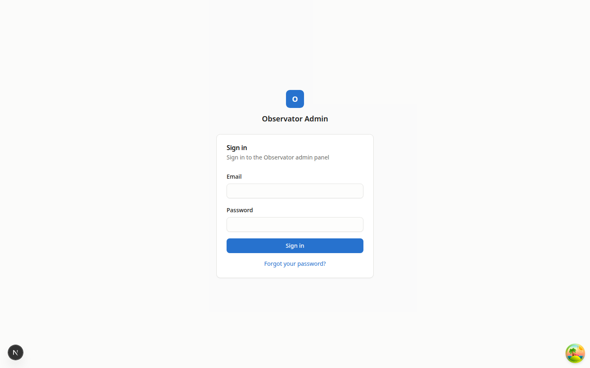
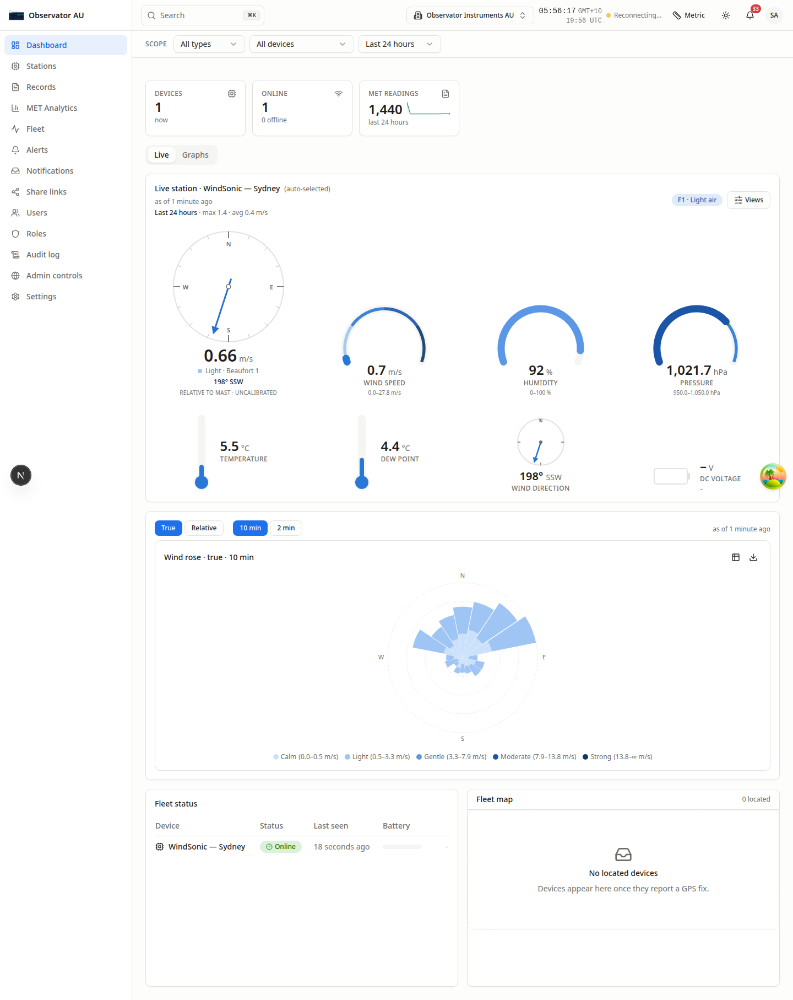
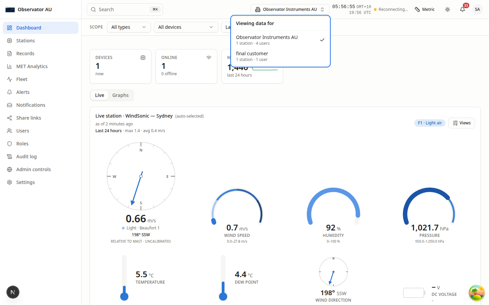
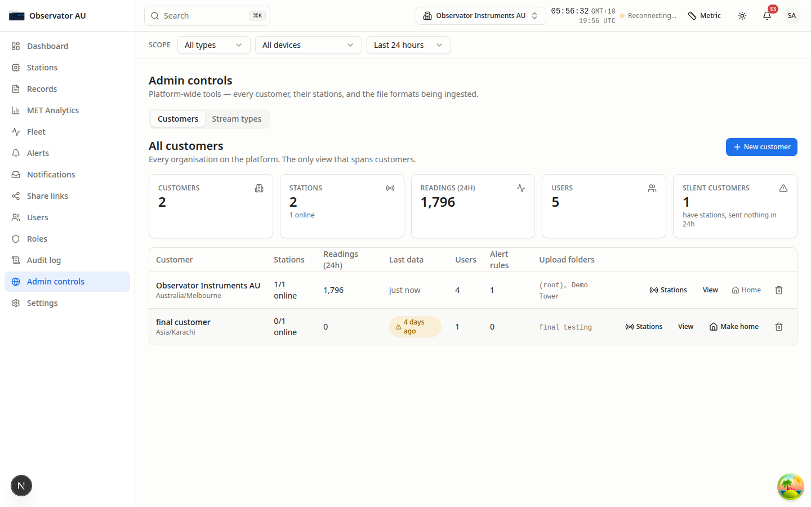
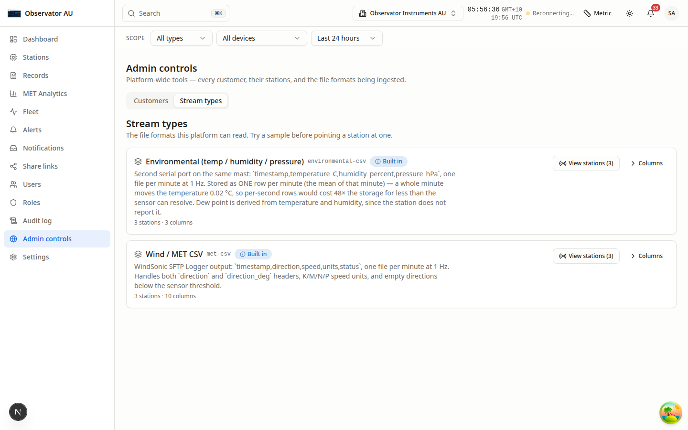
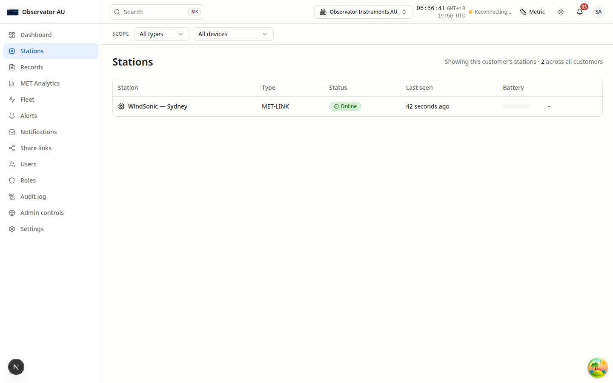
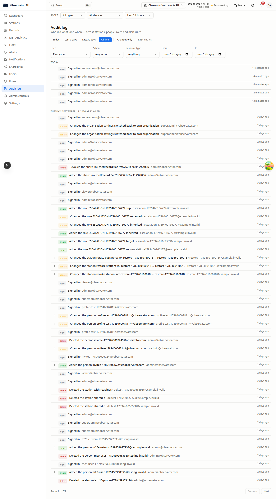

# Admin Portal — Platform Administrator Guide

**Observator Environmental Monitoring Portal**
For Observator staff managing customers, stations and the platform.

---

## Contents

1. [What makes an administrator different](#1-what-makes-an-administrator-different)
2. [Signing in](#2-signing-in)
3. [The customer switcher — read this first](#3-the-customer-switcher--read-this-first)
4. [Admin controls → Customers](#4-admin-controls--customers)
5. [Creating a customer](#5-creating-a-customer)
6. [Managing a customer's stations](#6-managing-a-customers-stations)
7. [Deleting a customer](#7-deleting-a-customer)
8. [Admin controls → Stream types](#8-admin-controls--stream-types)
9. [Customer screens, seen as an administrator](#9-customer-screens-seen-as-an-administrator)
10. [Audit log](#10-audit-log)
11. [How data actually arrives](#11-how-data-actually-arrives)
12. [Troubleshooting](#12-troubleshooting)

---

## 1. What makes an administrator different

A platform administrator is not a role — it's a flag on your account. It gives you
two things no customer has:

1. **The customer switcher** in the top bar, to act as any customer
2. **Admin controls** in the sidebar, the only screens that span customers

Everything else you see is the ordinary customer portal, showing **whichever
customer you are currently acting as**.

> **The most important rule:** apart from Admin controls, every screen shows **one
> customer at a time** — the one selected in the switcher. There is no "all
> customers" view of records, analytics or alerts, by design. This is what stops
> one customer's data appearing under another's name.

---

## 2. Signing in



Same sign-in screen as customers. Your administrator flag is applied automatically.



After signing in you land on the dashboard **for the customer you last acted as**.
Note the customer name in the top bar.

---

## 3. The customer switcher — read this first



The dropdown in the top bar showing the current customer's name. It decides whose
data every screen shows.

- Each entry lists the customer with their station and user count
- **Return to my organisation** goes back to your own
- Switching **reloads the page completely**

**Why the full reload matters:** switching customer has to be total. A partial
switch would leave the live-data connection joined to the previous customer, and
any station filter in the address bar would still name their station. The reload
clears all of it at once.

After switching, a banner appears on every screen showing which customer you are
acting as. If you are ever unsure whose data you are looking at, check the top bar.

---

## 4. Admin controls → Customers



**The only screen that spans every customer.**

### Summary tiles

| Tile | Meaning |
|---|---|
| **Customers** | Total organisations on the platform |
| **Stations** | Total stations, and how many are online |
| **Readings (24h)** | Readings received across all customers |
| **Users** | Total user accounts |
| **Silent customers** | **Have stations but sent nothing in 24 hours** — the ones worth chasing |

**Silent customers is the tile to watch.** A customer with stations and no data has
something broken: the station is off, the agent has stopped, or the upload folder
is wrong.

### The customer table

| Column | Meaning |
|---|---|
| **Customer** | Name and timezone |
| **Stations** | Online / total |
| **Readings (24h)** | Volume received |
| **Last data** | When anything last arrived. A warning badge means it's stale |
| **Users** | Accounts in that organisation |
| **Alert rules** | How many rules they have configured |
| **Upload folders** | Their SFTP folder names |

### Row actions

| Action | What it does |
|---|---|
| **Stations** | Opens station management for that customer |
| **View** | Switches to that customer and opens their dashboard |
| **Make home** / **Home** | Sets which customer you land on after signing in |
| **Trash icon** | Deletes the customer — see [section 7](#7-deleting-a-customer) |

---

## 5. Creating a customer

Select **+ New customer**.

| Field | Notes |
|---|---|
| **Customer name** | e.g. *Acme Marine Services* |
| **Upload folder** | Their SFTP folder name |
| **Time zone** | Type to search. **Set this correctly** — it decides where each day starts, which decides how readings are grouped into daily records |
| **First administrator** | First name, last name, sign-in email and password (at least 8 characters) |

This creates the organisation **and** its first admin account in one step. Give them
the sign-in details directly — there is no invitation email in this deployment.

---

## 6. Managing a customer's stations

Select **Stations** on a customer's row.

### Creating a station

Enter a station name (e.g. *Demo Tower*) and confirm. This does three things at once:

1. Creates the station in the database
2. Creates an **SFTP account** on the ingest server
3. Creates the **upload folder** the agent will watch

You'll then be shown the **host, port, username, password and folder**.

> **The password is shown once and never stored.** Copy it immediately — use
> **Copy all details**. If it's lost, use **Rotate password** to issue a new one;
> it cannot be looked up.

This is also why there is no "Add station" button on the customer-facing Stations
screen: a station created there would have no SFTP account and no folder, so
nothing could ever upload to it.

### Station status

| Badge | Meaning |
|---|---|
| **Receiving** | Working — the account is active and files are arriving |
| **Waiting for the agent** | Created, but the agent on the SFTP server hasn't picked it up yet. Normally under a minute |
| **Failed** | Provisioning failed. The error is shown on the row |

### Rotate password

Issues a new SFTP password. The only way to recover access, since passwords are
never stored.

### Deleting a station

Removes the station and its readings.

- If the customer has **other** stations, only that station's access is disabled
- If it's their **last** station, the whole SFTP account is disabled

Files already on the SFTP server are **never deleted** — they remain for replay.

---

## 7. Deleting a customer

The trash icon on a customer row.

**If the customer has active stations, deletion is refused** with a message telling
you to delete the stations first. This is deliberate: deleting an organisation
whose stations are still uploading would leave SFTP accounts writing into folders
that belong to nobody.

Order of operations:

1. Delete each station (via **Stations**)
2. Then delete the customer

---

## 8. Admin controls → Stream types



**The file formats the platform can read.** Customers see only their own; you see
all of them.

Each entry shows:

- **Name** and its internal key (e.g. `met-csv`)
- **Built in** badge for formats shipped with the platform
- A description of the exact columns it expects
- **How many stations** use it, and how many columns it defines
- **View stations** — which stations send this format
- **Columns** — expand to see every column the parser recognises

### The two live formats

| Format | File prefix | Contents |
|---|---|---|
| **Wind / MET CSV** (`met-csv`) | `WindSonic_` | `timestamp, direction, speed, units, status` — one file per minute at 1 Hz |
| **Environmental** (`environmental-csv`) | `Environmental_` | `timestamp, temperature_C, humidity_percent, pressure_hPa` — one file per minute at 1 Hz |

Both are stored as **one row per minute**. For wind, that row carries the minute
mean, the peak 3-second gust, and the rolling 2- and 10-minute means.

> *"No parser installed"* means files of that type are arriving but nothing can read
> them. They are quarantined, never deleted, and can be replayed once a parser
> exists.

---

## 9. Customer screens, seen as an administrator

Every other screen is the customer portal, scoped to the customer in the switcher.
Two differences:

### Stations



Shows **only the current customer's** stations — the same list they see. A count of
all stations across every customer is shown beside the heading, so you keep a sense
of fleet size without mixing customers into one table.

### Stream types

Not in your sidebar. Yours is the cross-customer tab under Admin controls; the
customer-facing one would be a second, narrower version of the same screen.

For everything else — Dashboard, Records, Analytics, Fleet, Alerts, Notifications,
Share links, Users, Roles, Settings — see the **Customer Portal Guide**. They behave
identically; only whose data they show changes.

---

## 10. Audit log



Every change, scoped to the customer you are acting as.

Administrator actions are recorded too — including **switching into a customer**,
which appears in that customer's log. Acting as a customer is visible, not silent.

Filter by action, resource type, user or date range. **View changes** shows exact
before-and-after values.

---

## 11. How data actually arrives

Useful context when troubleshooting.

```
Weather station  →  SFTP server  →  Ingest agent  →  Backend API  →  Portal
                    (per customer)   (per station)
```

1. The station writes a CSV file **every minute** into its upload folder
2. An ingest agent — **one per station**, so they can't block each other — sees the
   file and sends it to the API
3. The API checks the file's fingerprint (SHA-256). A file already seen is **never
   ingested twice**, even if the agent retries
4. Readings are quality-checked, aggregated to one record per minute, and stored
5. Files move `upload → staging → archive` and are **kept permanently**

### Quality control

Every reading is checked before storage:

| Check | Catches |
|---|---|
| **Sensor status** | The sensor reporting its own fault |
| **Range** | Physically impossible values |
| **Step** | Changes faster than physically possible |
| **Persistence** | A value frozen for hours — a stuck sensor |
| **Consistency** | e.g. dew point above air temperature |

A failed check **flags** the reading and excludes it from averages. Nothing is
deleted, and the original file remains on the SFTP server.

### Retention

| Data | Kept for |
|---|---|
| Minute-by-minute readings | **2 years** |
| Daily summaries | **Permanently** |
| Raw files on SFTP | **Permanently** |
| Raw per-second samples | Only when switched on per station, then 7 days |

---

## 12. Troubleshooting

**A customer appears under "Silent customers".**
They have stations but sent nothing in 24 hours. Check, in order: is the station
powered and online; is the ingest agent running; does the upload folder name match
what's configured.

**A station shows "Waiting for the agent" for more than a few minutes.**
The provisioning agent on the SFTP server hasn't processed the job. Check it is
running.

**A customer says their data is missing.**
Check the scope bar first — the date range is the usual cause. Then check
**Last data** on the Customers screen to see whether anything is arriving at all.

**Files are arriving but no readings appear.**
The filename prefix probably doesn't match a configured stream type. Unrouted files
are quarantined rather than guessed at. Check **Stream types**.

**A station's SFTP password was lost.**
It cannot be recovered — passwords are never stored. Use **Rotate password**.

**I can't tell which customer I'm looking at.**
Check the top bar. The banner below it names the customer whenever you are acting
as one.
