# Customer Portal — User Guide

**Observator Environmental Monitoring Portal**
For customers using the portal to view their own weather stations.

---

## Contents

1. [Signing in](#1-signing-in)
2. [Getting around](#2-getting-around)
3. [Dashboard](#3-dashboard)
4. [Stations](#4-stations)
5. [Records](#5-records)
6. [Record detail](#6-record-detail)
7. [MET Analytics](#7-met-analytics)
8. [Fleet](#8-fleet)
9. [Alerts](#9-alerts)
10. [Notifications](#10-notifications)
11. [Share links](#11-share-links)
12. [Users](#12-users)
13. [Roles](#13-roles)
14. [Audit log](#14-audit-log)
15. [Stream types](#15-stream-types)
16. [Settings](#16-settings)
17. [Who can do what](#17-who-can-do-what)

---

## 1. Signing in

Enter your email and password, then select **Sign in**.

**Forgot your password?** — select the link below the button. You'll be emailed a
code to set a new password.

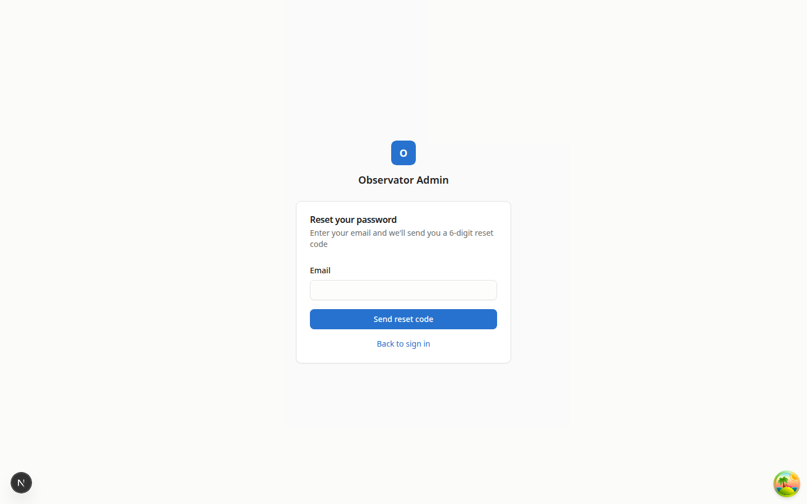

> **If you see "incorrect email and password" repeatedly**, wait a minute before
> trying again. Sign-in is limited to 10 attempts per minute to protect your
> account.

---

## 2. Getting around

Every screen shares the same three elements.

### The sidebar (left)

Your menu. Which entries you see depends on your role — see
[Who can do what](#17-who-can-do-what).

### The top bar

| Item | What it does |
|---|---|
| **Search** (⌘K / Ctrl+K) | Jump to any station, record or screen by typing |
| **Clock** | Station local time on top, UTC beneath. Always the **station's** timezone, not your computer's |
| **Connection dot** | Green = live data flowing. "Reconnecting" = temporarily offline |
| **Metric** | Switches the units shown across the whole portal |
| **Sun / moon** | Light or dark theme |
| **Bell** | Unread notifications |
| **Your initials** | Profile menu and **Sign out** |

### The scope bar

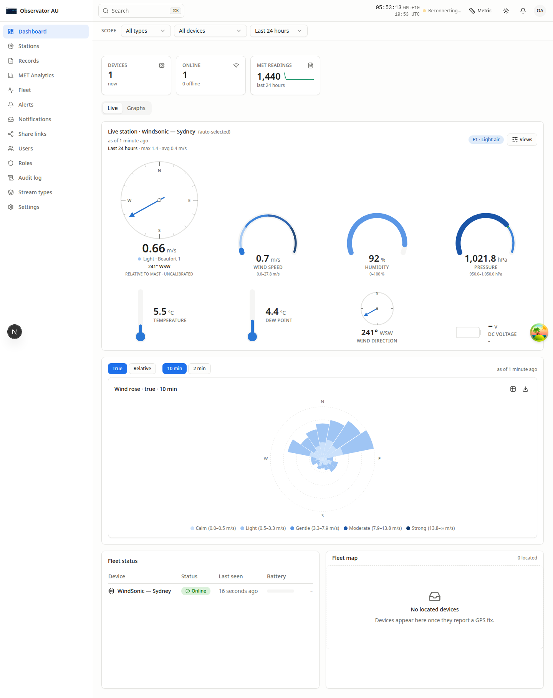

Three controls that decide what **every** screen below shows:

| Control | Purpose |
|---|---|
| **All types** | Station type (MET-LINK weather stations) |
| **All devices** | One station, or all of them |
| **Last 24 hours** | The time range |

**Change these once and every chart, table and figure follows.** If a screen looks
empty, this is almost always the reason — widen the range or pick a different
station.

Time range options: Last hour · Last 24 hours · Last 7 days · Last 30 days ·
All time · Today · Yesterday · Last 7 days (calendar) · or a custom range.

---

## 3. Dashboard

The home screen — what your stations are doing right now.

### Top tiles

| Tile | Meaning |
|---|---|
| **Devices** | How many stations you have |
| **Online** | How many are currently reporting, and how many are not |
| **MET readings** | Readings received in the selected range |

### Live / Graphs

- **Live** — current values, as shown above
- **Graphs** — the same values plotted over time

### The live station panel

Shows your currently selected station, or auto-selects one if you haven't chosen.

- **Compass** — wind direction with an arrow. The number below is the bearing in
  degrees and the compass point (e.g. 241° WSW)
- **"Relative to mast · uncalibrated"** — means the mast's true heading hasn't been
  surveyed yet, so directions are relative to the mast rather than true north
- **Beaufort badge** (e.g. *F1 · Light air*) — the wind force in plain language
- **Gauges** — wind speed, humidity, pressure. The small numbers underneath are the
  gauge's range, not a reading
- **Thermometers** — temperature and dew point
- **Views** — save a layout you like and switch back to it later

### Wind rose

Shows which directions the wind has been blowing from, and how strongly. Longer
petals = wind came from that direction more often. Colours = wind strength bands.

- **True / Relative** — true north, or relative to the mast
- **10 min / 2 min** — the averaging period
- Icons top-right: view as a **table**, or **download** the data

### Fleet status

Every station with its online state, when it was last heard from, and battery.

### Fleet map

Plots stations that report a GPS position. Fixed weather masts don't report one, so
this normally reads *"No located devices"* — that is expected, not a fault.

---

## 4. Stations

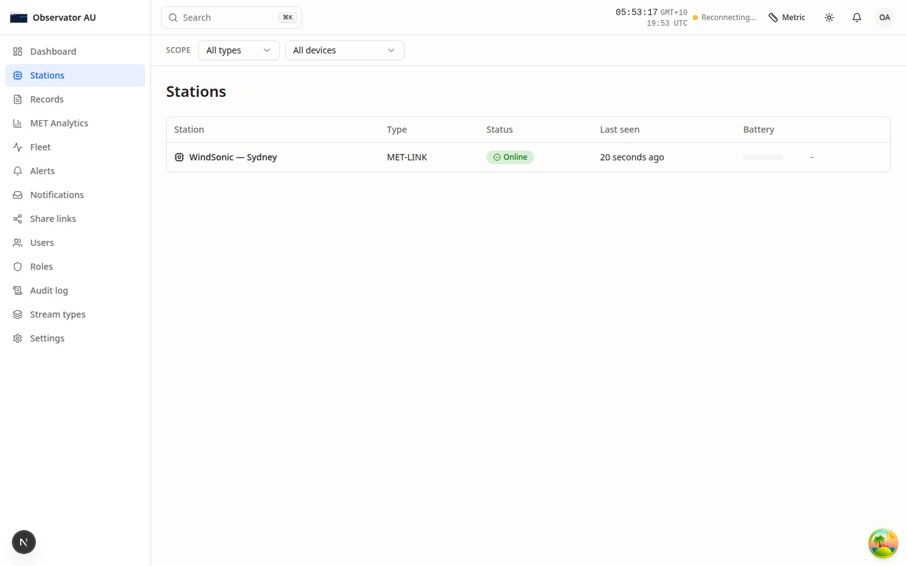

Your weather stations.

| Column | Meaning |
|---|---|
| **Station** | Name — click the row to open it |
| **Type** | MET-LINK (weather) |
| **Status** | Online or Offline |
| **Last seen** | When data last arrived |
| **Battery** | Battery level, where the station reports one |

New stations are created by Observator when your SFTP account is set up, so there
is no "Add station" button here — a station added by hand would have no upload
folder and could never receive data.

### Station detail

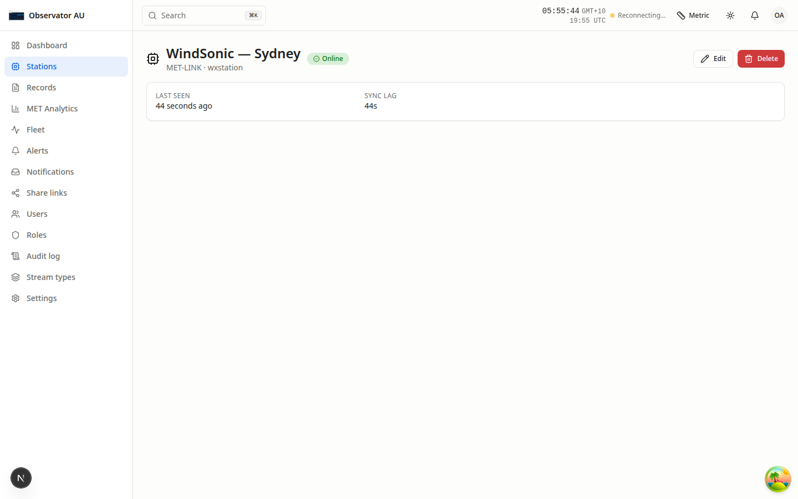

Opens when you click a station. Shows live status, the sensors it actually reports,
and battery voltage. Admins can rename it here.

---

## 5. Records

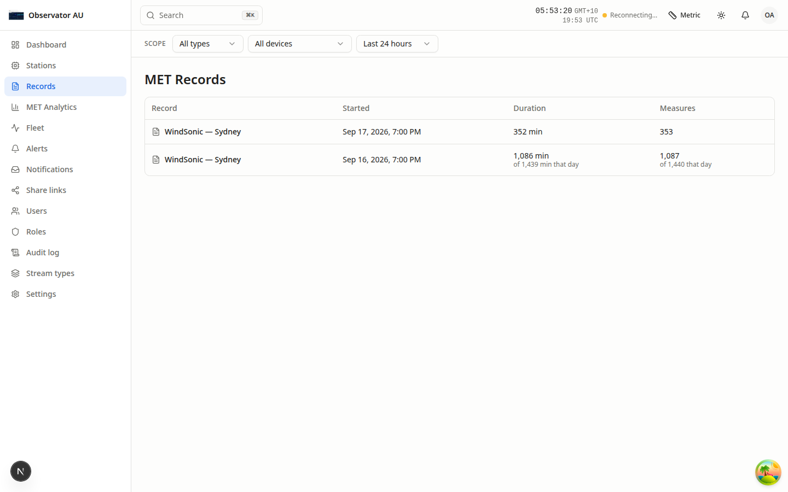

**A record is one station's data for one day.** Files arrive through the day and are
collected into that day's record.

| Column | Meaning |
|---|---|
| **Record** | Station name and the day |
| **Started** | First reading of the day |
| **Duration** | Span from first to last reading |
| **Measures** | How many readings the record holds |

Use the scope bar to choose the station and date range. Click any row to open it.

---

## 6. Record detail

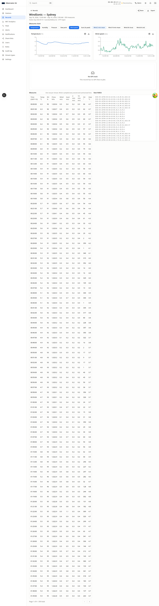

Everything recorded on one day.

### Header

Station name, the day and its time span, the number of measures, the station's
timezone, and how the data arrived (*SFTP ingest*).

**Share** creates a public link. **Export** downloads the data as CSV.

### Measures chart

Select up to **five** channels from the buttons to plot them:

| Channel | Meaning |
|---|---|
| **Temperature** | Air temperature |
| **Humidity** | Relative humidity |
| **Pressure** | Barometric pressure |
| **Dew point** | Temperature at which air becomes saturated — the closer to air temperature, the closer to fog |
| **Wind speed** | One-minute average |
| **Gust (3s peak)** | Highest 3-second average in that minute — the WMO standard gust |
| **Wind 2-min mean** | Rolling 2-minute average |
| **Wind 10-min mean** | Rolling 10-minute average — the WMO standard reporting wind |
| **Wind dir (true)** | Direction relative to true north |
| **Wind dir (rel)** | Direction relative to the mast |

The charts follow the date range in the scope bar.

### Measures table

One row per minute. Wind is sampled every second and summarised into that row.

| Column | Meaning |
|---|---|
| **Time** | Shown in the **station's** timezone, named in the column header |
| **Temp / RH / Press** | Temperature, humidity, pressure |
| **Wind** | One-minute mean |
| **Gust** | Peak 3-second gust in that minute |
| **2-min / 10-min** | Rolling averages |
| **Dir** | Wind direction |
| **Dew** | Dew point |
| **QC** | Appears only when a reading failed a quality check — hover for the reason |

An asterisk on a 10-minute value means it was built from fewer than 10 minutes of
data — hover to see how many.

### Raw NMEA

The original sensor sentences, exactly as received. Useful for troubleshooting.

---

## 7. MET Analytics

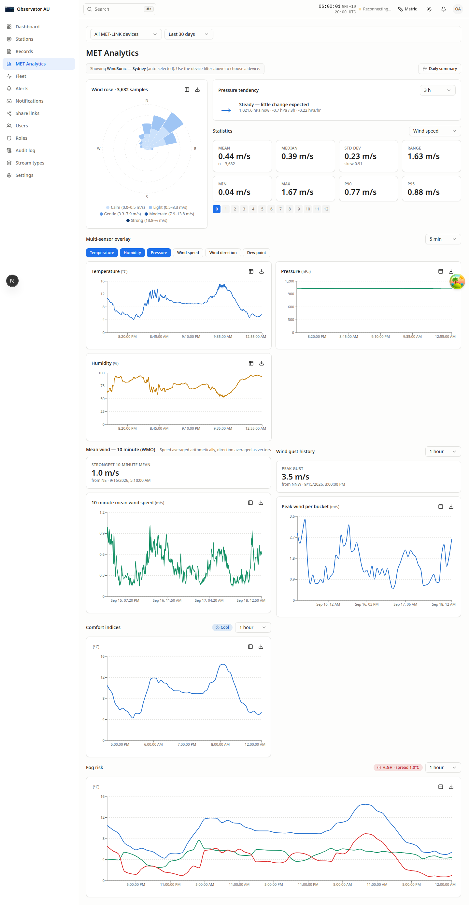

Deeper analysis over a longer period. Choose the station and range at the top.

### Wind rose

Same as the dashboard, over the selected range. The heading shows how many samples
it's built from.

### Pressure tendency

Whether pressure is rising, falling or steady — a simple forecast indicator.
Falling pressure generally means worsening weather.

### Statistics

Pick a sensor and see **Mean, Median, Std dev, Range, Min, Max, P90, P95**.

- **P90 / P95** — 90% and 95% of readings were below this value. Useful for
  "how strong does it usually get" without one freak gust distorting the answer.
- **Buttons 0–12** — Beaufort force. Select one to see how much time was spent at
  that wind force.

### Multi-sensor overlay

Toggle Temperature, Humidity, Pressure, Wind speed, Wind direction and Dew point to
compare them over the same period. The dropdown sets the averaging interval.

### Mean wind — 10 minute (WMO)

The world-standard reporting wind: speed averaged arithmetically, direction averaged
as vectors (so 350° and 10° average to north, not south).

**Strongest 10-minute mean** highlights the windiest sustained period.

### Wind gust history

**Peak gust** — the strongest 3-second average in the period, with when and from
which direction.

### Comfort indices

How the weather actually *feels* — heat index in warm weather, wind chill in cold.
The badge summarises it in one word (e.g. *Cool*).

### Fog risk

The gap between temperature and dew point. A small gap means fog is likely. The
badge shows the current risk and the spread.

### Daily summary

Top-right — day-by-day totals and extremes.

---

## 8. Fleet

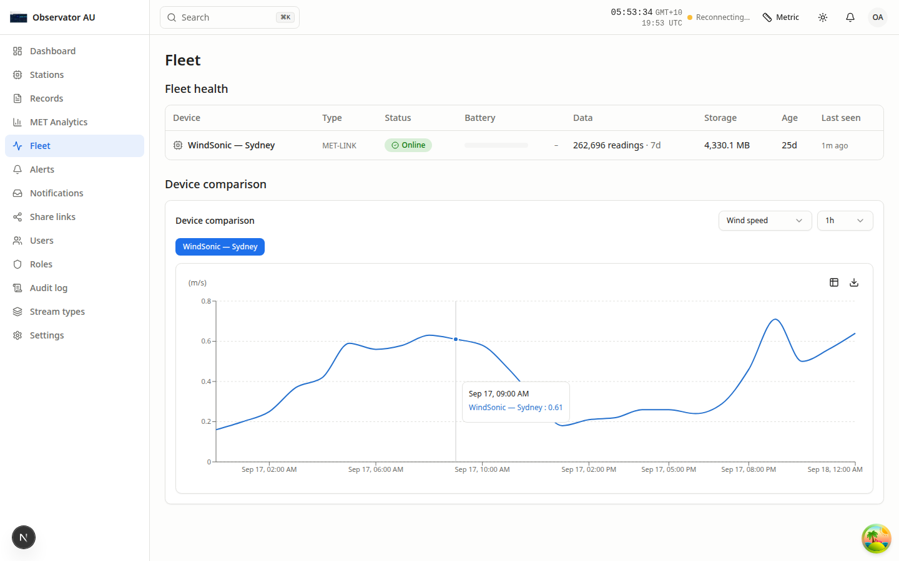

Compares stations side by side.

- **Fleet health** — each station's reporting reliability, gaps and data volume
- **Device comparison** — the same measurement across stations, useful for spotting
  one that's drifting or has failed

Most useful once you have several stations.

---

## 9. Alerts

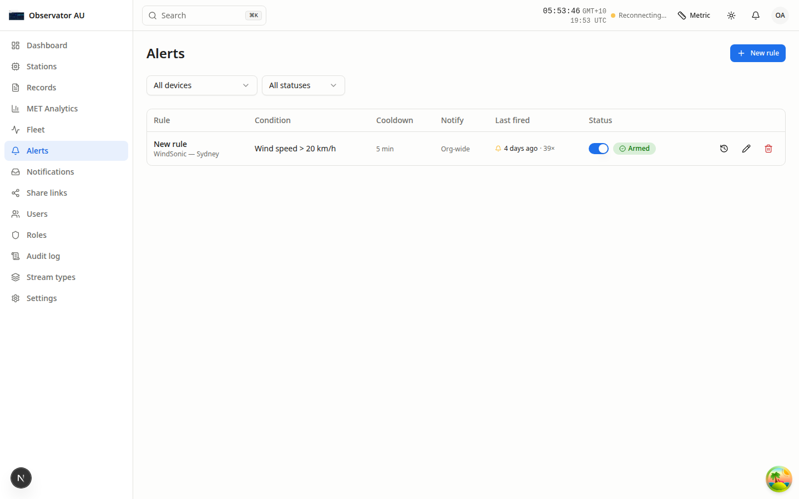

Rules that watch your data and notify you.

Each rule watches **one sensor** on **one station** and fires when a threshold is
crossed — for example wind above 15 m/s.

- **Status filter** — All statuses / Armed / Paused
- **Armed** — active and watching
- **Paused** — kept but not firing

When a rule fires you get a notification, and it's recorded in the alert timeline.

*Requires the Operator or Admin role.*

---

## 10. Notifications

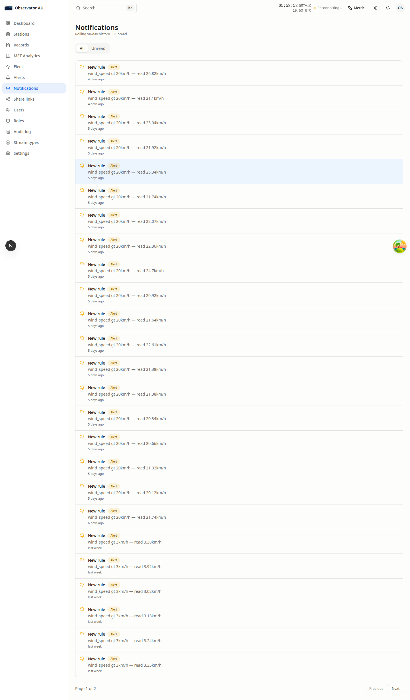

Everything the portal has told you: triggered alerts, completed uploads, system
messages.

Use the **Unread** filter to see only new items. The bell in the top bar shows the
unread count.

---

## 11. Share links

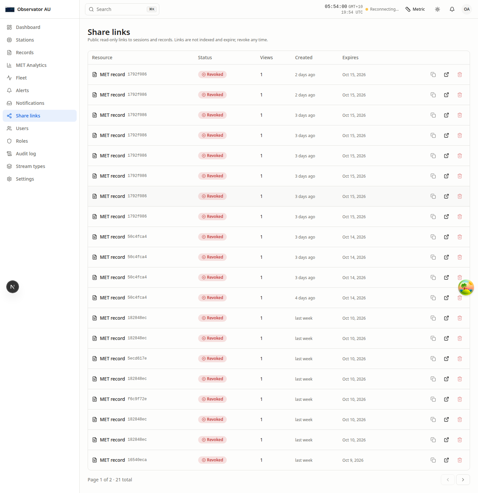

Creates a **public web link** to a record, so someone without a login can view it.

- Created from the **Share** button on a record
- Anyone with the link can view — treat it like a password
- Links can be revoked here at any time
- Revoking takes effect immediately

*Requires permission to export data.*

---

## 12. Users

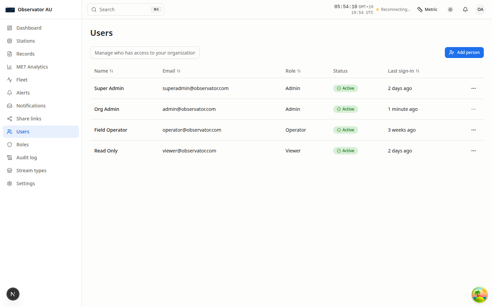

The people in your organisation.

| Column | Meaning |
|---|---|
| **Name / Email** | Who they are |
| **Role** | What they can do |
| **Status** | Active, Inactive or Pending |
| **Last sign-in** | When they last used the portal |

Admins can change a person's role or deactivate them. Deactivating blocks sign-in
immediately but keeps their history in the audit log.

*Admins only.*

---

## 13. Roles

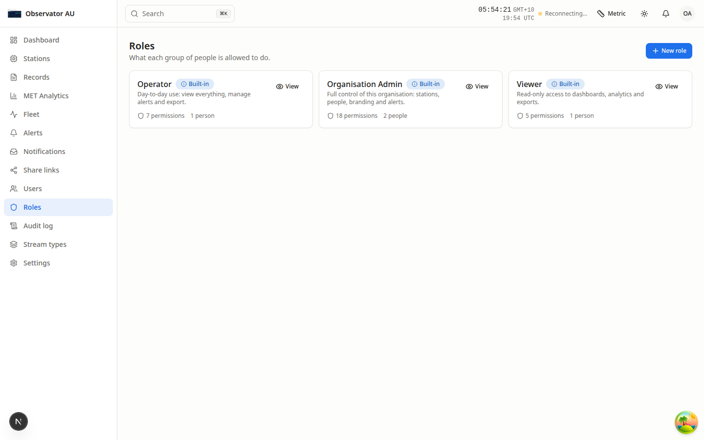

What each role is allowed to do.

**Built-in roles** — Viewer, Operator, Admin. Marked *Built-in* and shown with a
**view** icon: you can inspect them but not change them, so they mean the same
thing on every account.

**Custom roles** — create your own with exactly the permissions you want.

Broadly:

| Role | Can do |
|---|---|
| **Viewer** | View data, export it |
| **Operator** | The above, plus manage alerts and add comments |
| **Admin** | Everything, including users, roles and organisation settings |

*Admins only.*

---

## 14. Audit log

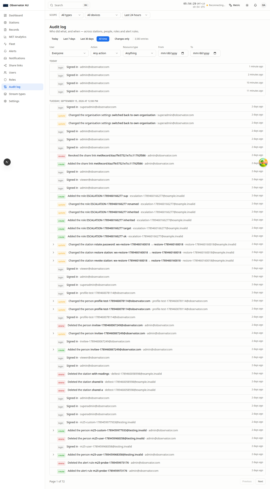

A permanent record of every change made in your organisation — who did what, when.

| Column | Meaning |
|---|---|
| **Time** | When it happened |
| **User** | Who did it |
| **Action** | Create, update, delete, sign-in… |
| **Resource** | What was affected |
| **Changes** | **View changes** shows the before and after values |

Filter by action, resource type, user, or date range.

*Admins only.*

---

## 15. Stream types

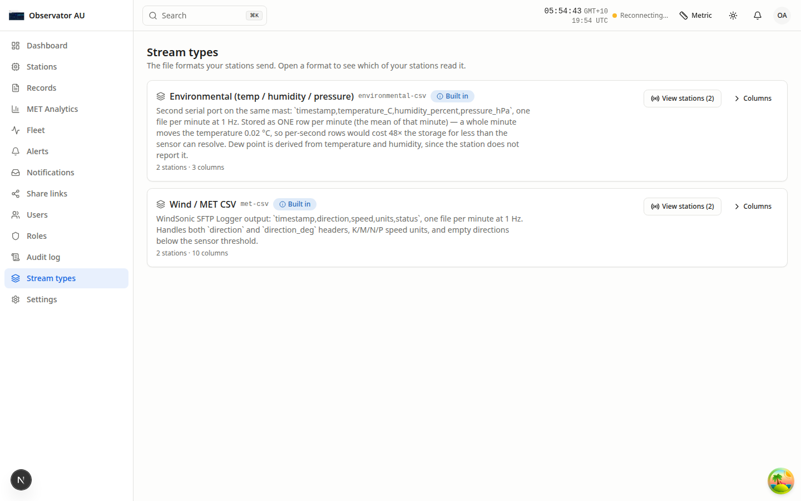

The **file formats** your stations send, and whether each is being read.

Each entry shows the format name, the filename prefix it matches (e.g.
`WindSonic_`), and which of your stations use it.

This screen is **read-only** for customers — it's here so you can confirm your data
is being recognised. Formats are configured by Observator.

*"No parser installed"* means files of that type are arriving but aren't being
read — contact support.

---

## 16. Settings

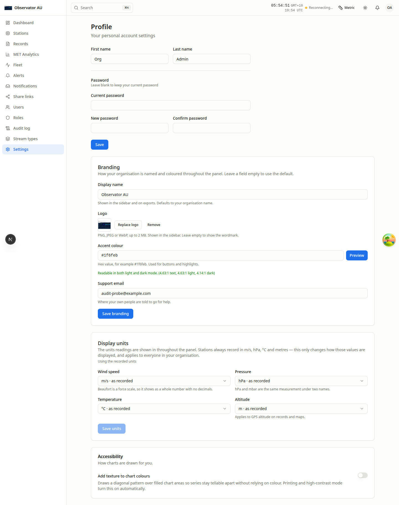

### Profile

Your own name and password. Leave the password fields blank to keep your current
one.

### Branding

How your organisation appears throughout the portal.

| Field | Purpose |
|---|---|
| **Display name** | Shown in the sidebar and on exports |
| **Logo** | PNG, JPEG or WebP up to 2 MB |
| **Accent colour** | Hex value for buttons and highlights. **Preview** checks it's readable in both light and dark mode before you save |
| **Support email** | Where your people are told to go for help |

### Display units

Changes how readings are **shown**. Stations always record in m/s, hPa, °C and
metres — this only changes the display, and it applies to everyone in your
organisation.

| Setting | Options |
|---|---|
| **Wind speed** | m/s, km/h, knots, mph, Beaufort |
| **Pressure** | hPa, mbar, inHg |
| **Temperature** | °C, °F |
| **Altitude** | metres, feet |

*Note: hPa and mbar are the same measurement under two names. Beaufort is a force
scale, so it shows as a whole number.*

### Accessibility

**Add texture to chart colours** — draws a diagonal pattern over filled chart areas
so series stay distinguishable without relying on colour. Turns on automatically
when printing or in high-contrast mode.

---

## 16b. Organisation settings

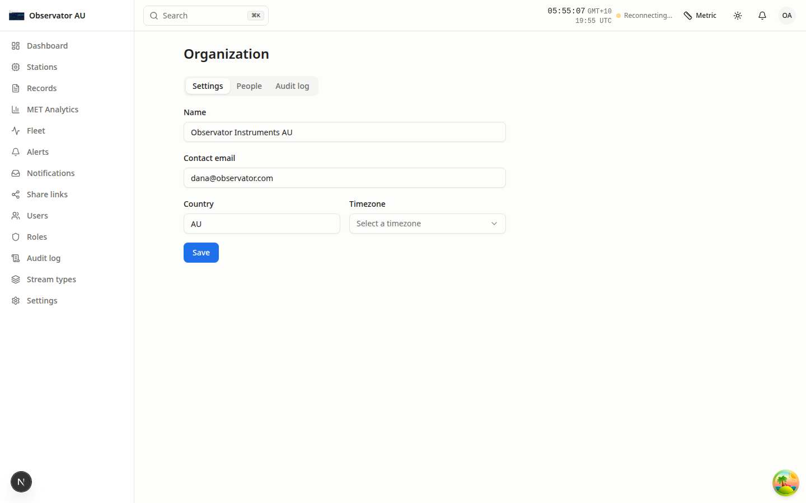

**Not in the sidebar** — open it directly at **`/org`**.

This is the only place to change your organisation's core details:

| Field | Purpose |
|---|---|
| **Name** | Your organisation's legal/display name |
| **Contact email** | Where Observator contacts you |
| **Country** | |
| **Timezone** | **Important** — this decides where each day starts, which decides how readings are grouped into daily records, and it drives the clock in the top bar |

The **People** and **Audit log** tabs here are the same screens as **Users** and
**Audit log** in the sidebar.

> ⚠️ **Known issue:** the Timezone field currently shows *"Select a timezone"* even
> when one is already set, and the form cannot be saved until you choose one. Your
> stored timezone is unaffected — it is a display problem on this form only. Pick
> your timezone again before saving any change here, and check it is correct.

*Admins only.*

---

## 17. Who can do what

| Screen | Viewer | Operator | Admin |
|---|:---:|:---:|:---:|
| Dashboard, Stations, Records, Analytics, Fleet | ✅ | ✅ | ✅ |
| Export data, Share links | ✅ | ✅ | ✅ |
| Alerts (create / edit) | — | ✅ | ✅ |
| Comments and file uploads | — | ✅ | ✅ |
| Station settings | — | — | ✅ |
| Users, Roles, Audit log | — | — | ✅ |
| Organisation settings, Branding, Units | — | — | ✅ |

Screens you don't have access to are hidden from your sidebar rather than shown
and blocked.

---

## Common questions

**A screen is empty.**
Check the scope bar — the date range or station filter is usually the cause. Widen
the range or choose a different station.

**A chart shows no data but others do.**
That sensor isn't fitted to the station. Only channels your stations actually
report appear in the chart picker.

**The clock shows two times.**
The top is the station's local time, the bottom is UTC. All readings are stamped in
station time.

**How far back does data go?**
Detailed minute-by-minute readings are kept for **two years**. Daily summaries are
kept permanently.

**"No GPS track" / "No located devices".**
Fixed weather masts don't report a position. Expected, not a fault.
