# Weather Monitoring Portal — Sydney Metro M1 — User Manual

## Contents

1. [Before you start](#before-you-start)
2. [Signing in and out](#signing-in-and-out)
3. [Finding your way around](#finding-your-way-around)
4. [Map — the whole line at a glance](#map---the-whole-line-at-a-glance)
5. [Alerts](#alerts)
6. [Stations](#stations)
7. [Trends and Flood](#trends-and-flood)
8. [History — finding and exporting data](#history---finding-and-exporting-data)
9. [Health — is the system working?](#health---is-the-system-working)
10. [Administration](#administration)
11. [Your settings](#your-settings)
12. [Who can do what](#who-can-do-what)
13. [Quick answers](#quick-answers)

## Before you start

The portal shows the weather and flood monitoring for the Sydney Metro M1 line in one
place: seven monitoring locations, the Marrickville flood pumps, every alert, and the
health of the equipment. It works in any modern web browser — on a desktop, a laptop,
a tablet or a phone — with nothing to install.

> **This is a design prototype.** Every reading is demonstration data. No sensors are
> connected, and no emails, alerts or pump commands are sent. The screens are complete
> so the design can be reviewed; the working system is built after approval.

**Colours mean the same thing everywhere:**

| Colour | Meaning |
|---|---|
| Red | Alert — a threshold has been crossed and action is needed |
| Amber | Warning — approaching a threshold, or something to check |
| Green | Normal / running / in service |
| Grey | Offline or no data |
| Blue | Information, or a pump command you can take |

Every status also has a word and an icon beside the colour, so it can be read without colour.

**Charts.** A dashed red line on a chart is a threshold. Hover over (or tap) a chart to
read exact values. The two small icons at the top right of every chart switch to a
**table view** and **download the data as CSV**.

## Signing in and out

### Sign in

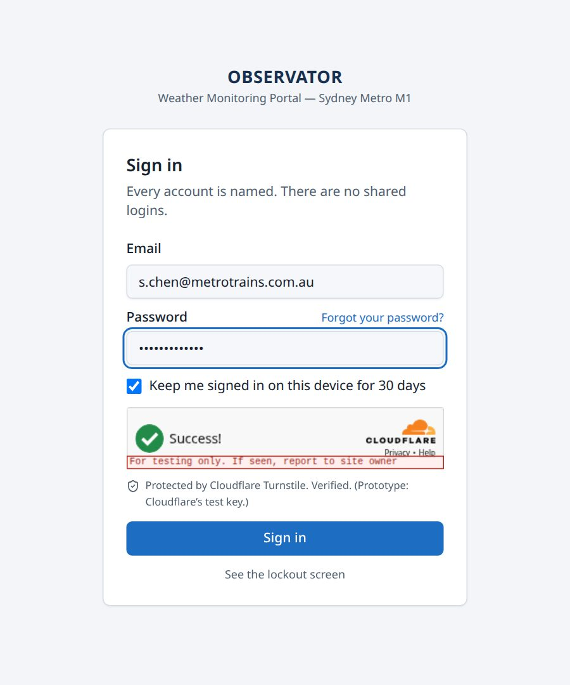

1. Open the portal link. Every page asks you to sign in first.
2. Enter your **email** and **password**.
3. Wait for the **security check** (Cloudflare) to show *Success*. It usually passes on its own; occasionally it asks you to tick a box.
4. Leave **Keep me signed in on this device for 30 days** ticked on your own device. Untick it on a shared computer — you will then be signed out when the browser closes.
5. Select **Sign in**. You go straight to the page you opened.

If the details are wrong you see *That email and password do not match*. Your email
stays filled in; type the password again.

### Forgotten your password

You reset it yourself — nobody at MTS needs to be involved.

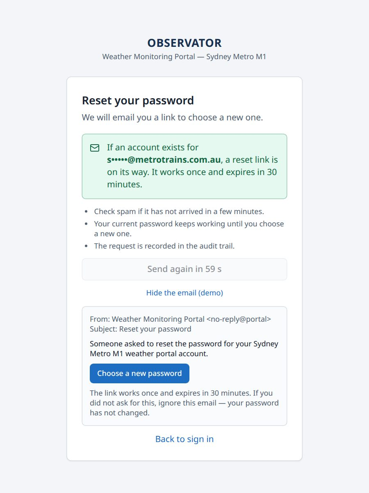

1. On the sign-in screen select **Forgot your password?**
2. Enter your work email, pass the security check and select **Send the reset link**.
3. Open the email and select **Choose a new password**. The link works **once** and expires after **30 minutes**. If it has expired, ask for a new one.

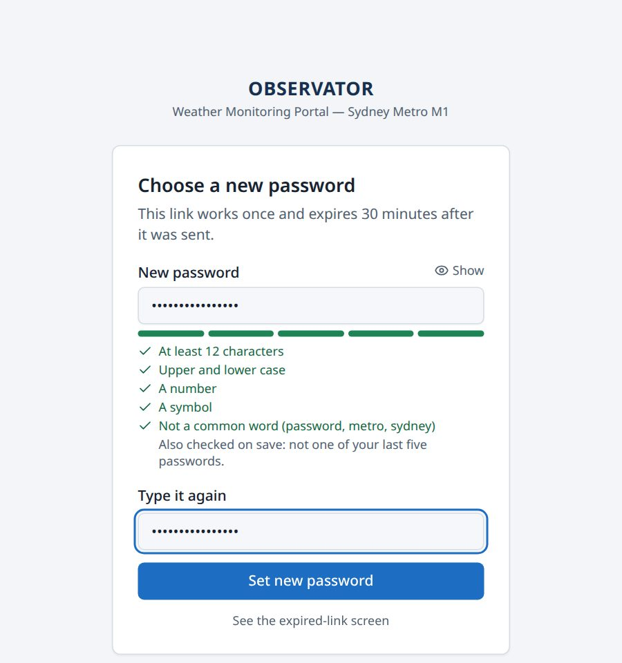

4. Type the new password twice. The rules turn green as they are met: at least 12
   characters, upper and lower case, a number, a symbol, and not a common word.
5. Select **Set new password**. You are signed out on every other device, and you receive a confirmation email.

> The reset screen never says whether an email address has an account. That stops the
> page being used to find out who works at MTS.

### Sign out

Select your **initials** (top right) and choose **Sign out**. On a phone, open the
**☰** menu — *Sign out* is at the bottom. After signing out, every page asks for your
email and password again.

## Finding your way around

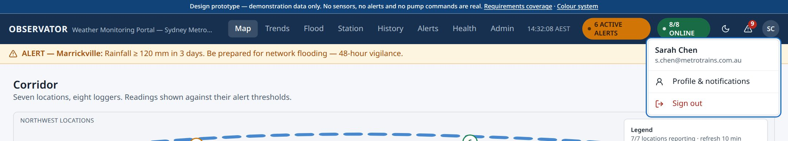

Along the top of every page:

- **Menu** — Map, Trends, Flood, Station, History, Alerts, Health and Admin. On a phone, it sits behind the **☰** button.
- **Clock** — Sydney time, marked AEST or AEDT.
- **Active alerts** (amber) — how many alerts are in force. Select it to open Alerts.
- **Online** (green) — how many monitoring loggers are reporting, for example *8/8 online*.
- **Moon / sun** — switch between light and dark display.
- **Bell** — alerts not yet acknowledged.
- **Your initials** — your profile and notification settings, and Sign out.

Under the top bar, the **alert banner** repeats the most important alert in force,
with **Open** to go to it. A blue strip announces any **planned maintenance** at least
48 hours ahead.

## Map — the whole line at a glance

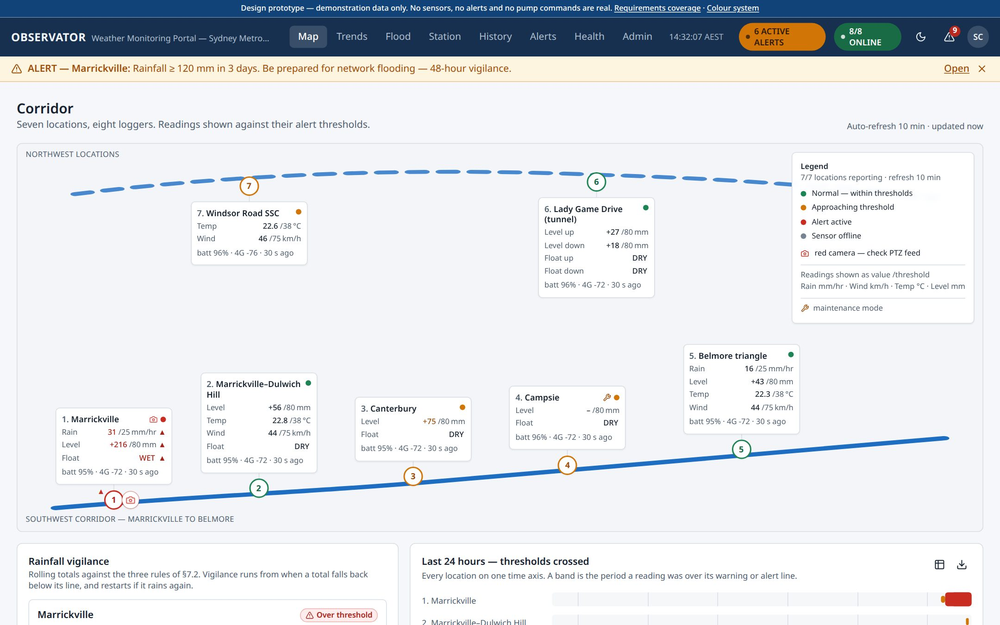

The map is the home page. It shows the line as a simple route, not a street map, with
each of the seven locations on it.

- Each **location card** shows its readings beside their thresholds — for example
  *Rain 31 / 25 mm/hr* means 31 against a threshold of 25.
- The **pin colour** gives the location's status. A **blinking red camera** means
  standing water needs checking on the camera; a **wrench** means the location is in
  maintenance.
- Select a location to open its station page.

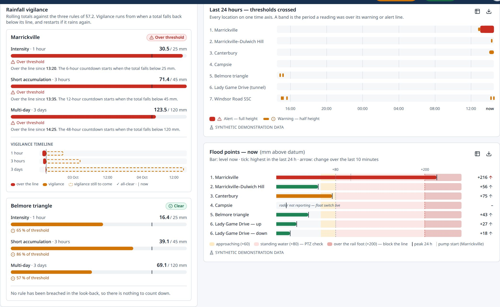

Further down the Map:

- **Rainfall vigilance** — for each rain gauge, the 1-hour, 3-hour and 3-day rainfall
  against the 25 mm, 45 mm and 120 mm rules. When a total falls back below its line,
  a countdown (6, 12 or 48 hours) runs before the all-clear. More heavy rain restarts it.
  The **vigilance timeline** draws this out.
- **Last 24 hours — thresholds crossed** — when each location was over its warning or alert line.
- **Flood points — now** — every water-level point on one scale against *standing
  water* and the *rail foot*, with the day's peak and whether the water is rising.

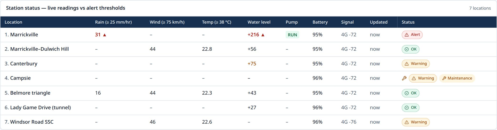

The **station status table** at the bottom lists every location's latest readings,
battery, signal and status in one table.

## Alerts

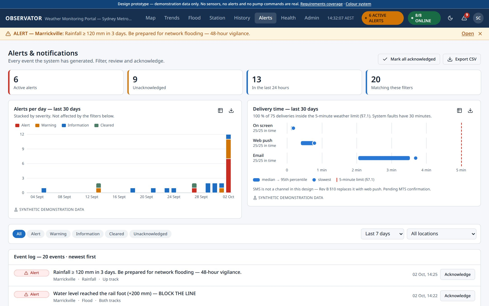

**Alerts** holds every alert the system has raised.

- The tiles at the top count active and unacknowledged alerts. The charts show alerts
  per day and how quickly each alert was delivered.
- **Filter** with the chips (Alert, Warning, Information, Cleared, Unacknowledged), the
  period and the location.
- Select **Acknowledge** on an alert to record that you have seen it. Your name and
  the time are saved. **Mark all acknowledged** does every alert in the list at once.
- **Export CSV** downloads the alerts in the list.
- Select an alert's text to open its own page.

### Verifying standing water on the camera

When water reaches *standing water* level, a window opens by itself asking you to
check the camera. The same window opens from the **PTZ** button on an alert, the red
camera on the map, or **Verify on PTZ camera** on the station page.

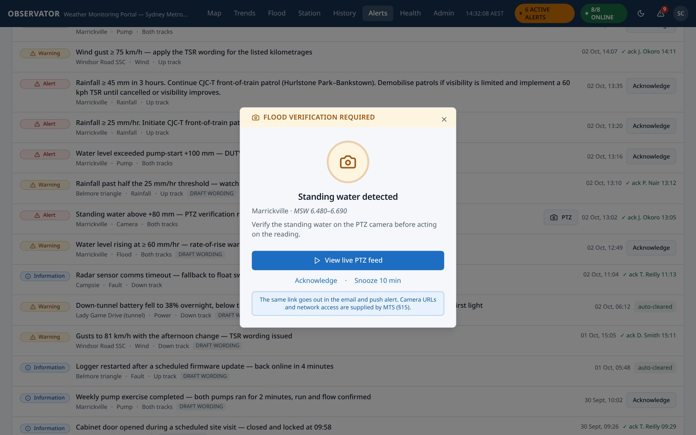

Choose **View live PTZ feed**, **Acknowledge**, or **Snooze 10 min** (it comes back
if still unacknowledged).

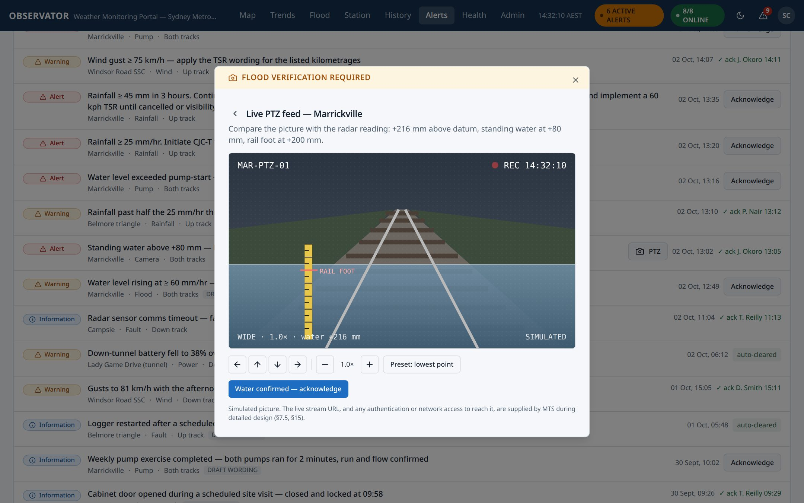

Use the arrows and zoom to move the camera; **Preset: lowest point** points it at the
gauge. When you can see the water, select **Water confirmed — acknowledge**.

### An alert's own page

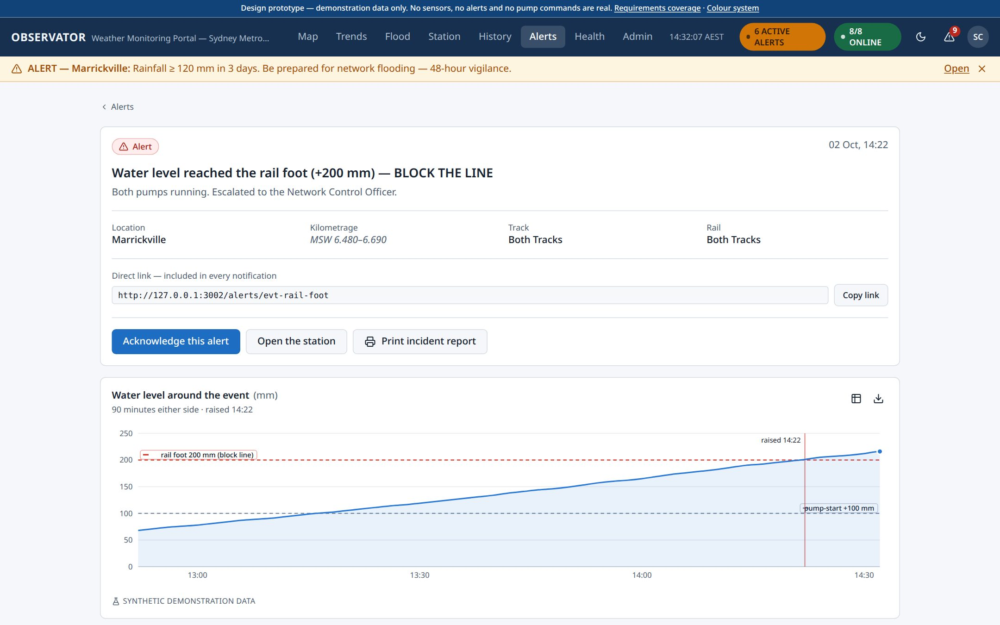

Every alert email and notification links to this page. It shows where and when the
alert happened (location, kilometrage, track and rail), the reading around that time with
when it was raised and acknowledged, who it was sent to and when it arrived, and any
**notes** added by the team. Use **Copy link** to share it, **Open the station** for the
location, and **Print incident report** for a one-page record.

## Stations

Open a station from the map, the status table, or **Station** in the menu. Each
station has two tabs: **Live** and **Installation**.

### Live

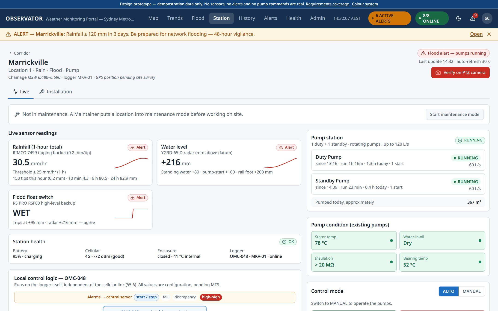

- **Live sensor readings** — one card per sensor, with its threshold and a small trend line.
- **Station health** — battery, mobile signal, cabinet and logger.
- **Maintenance mode** — a maintainer selects **Start maintenance mode** before working
  on site, so everyone can see why readings may be unusual. **End maintenance mode** when finished.
- Below the cards: the last 24 hours as charts, the battery and solar power for the
  last week, and how the station is reporting.

### Pumps (Marrickville)

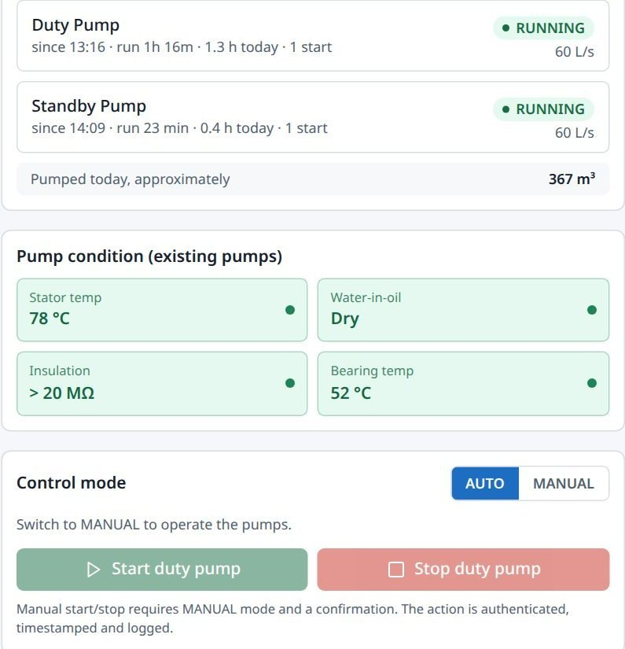

The pumps run themselves in **AUTO**: the duty pump starts at +100 mm, the standby pump
joins at +180 mm, and both stop once the water is back down. The panel shows each pump,
its run time, the pump-condition signals, and the **control logic** with each set point
marked as met or not.

To run a pump by hand (Pump Controller role only):

1. Switch **Control mode** to **MANUAL**.
2. Select **Start duty pump** or **Stop duty pump**.
3. Read the confirmation — what will happen, to which pump, and under your name — and confirm.

Every manual action is recorded with your name and the time. Switch back to **AUTO** when finished.

### Installation

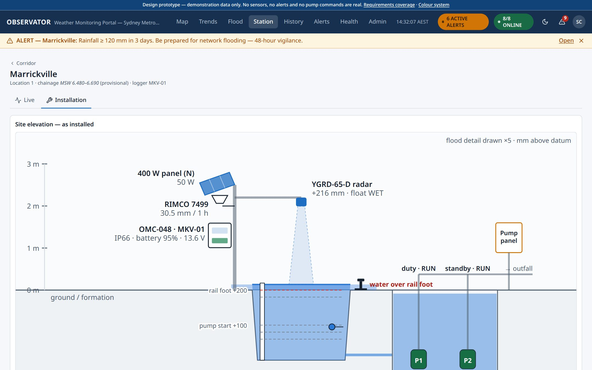

The **Installation** tab is for maintainers and engineers:

- **Site elevation** — a drawing of the station as installed, with live readings on it.
- **Wiring and connectivity** — each sensor on its logger connection, the power supply and the mobile link.
- **Equipment at this location** — the instruments fitted here, from the sensor register (see *Administration → Sensors*).
- **Requirement vs provided** — how each instrument meets the specification.

## Trends and Flood

### Trends

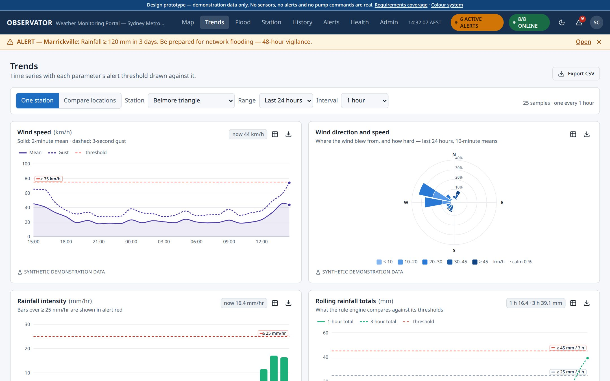

- **One station** shows every measurement at one location: wind, wind direction, rainfall,
  temperature, humidity, water level and air pressure.
- **Compare locations** shows one measurement across all locations.
- Choose the **station**, the **range** (for example last 24 hours or 7 days) and the **interval**.
- **Export CSV** downloads what is on screen.

### Flood

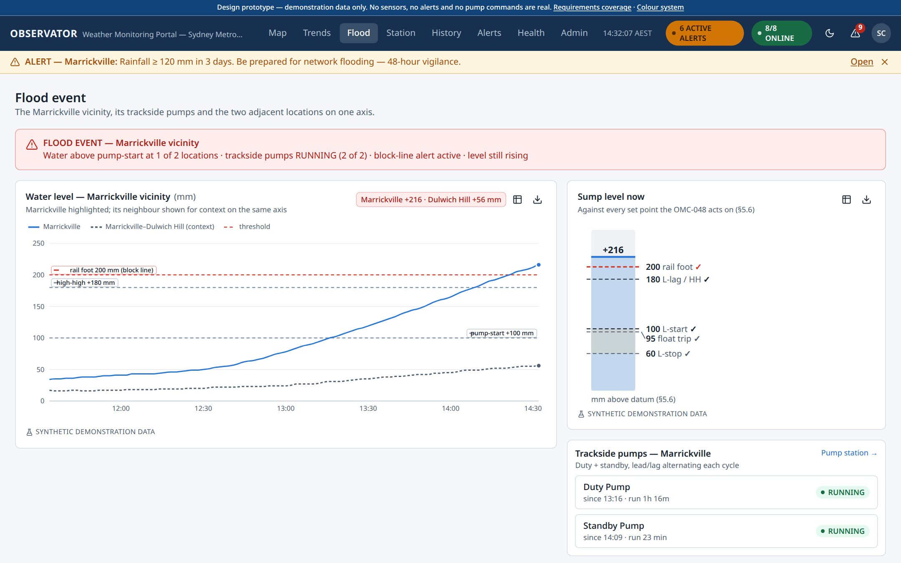

**Flood** brings everything about a flood at Marrickville onto one screen: the water
level at the two nearby points, the pump sump gauge, the pumps, a strip map of the
affected section, how fast the water is rising, the steps back to normal train speed
after the line is blocked, and the event log.

## History — finding and exporting data

1. Choose one or more **locations** and **measurements**.
2. Choose the **period** (last few days, or exact dates) and the **interval** (raw, 10 minutes, hourly or daily).
3. Select **Run query**.

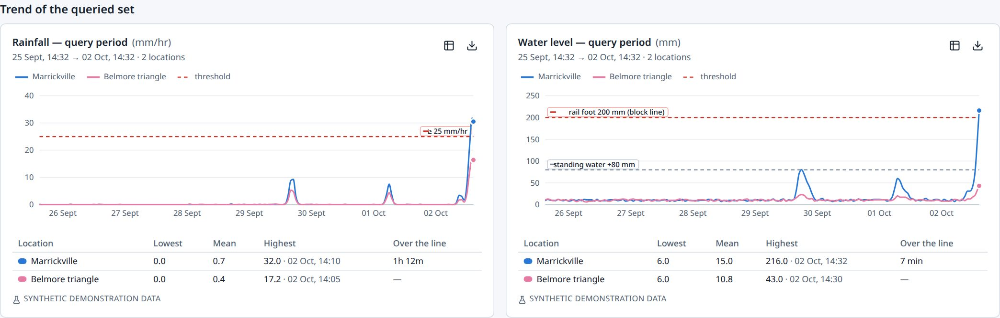

The results open with a chart for each measurement, one line per location, and the
lowest, average and highest values and the time spent over the threshold.

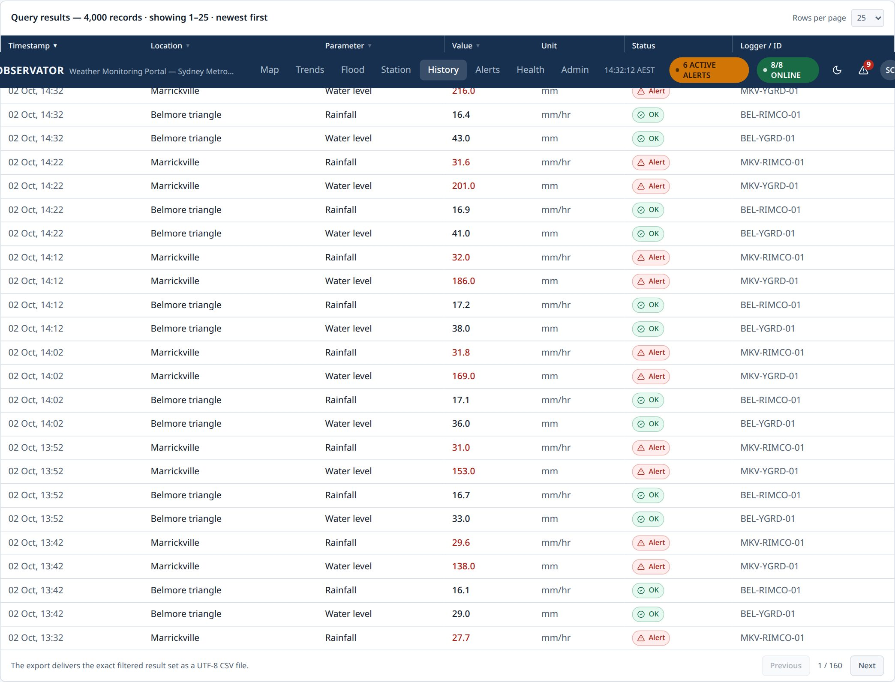

Underneath is the full table. Select a column heading to sort, choose how many rows to
show per page, and select **Export CSV** to download exactly the records you asked for.
The rainfall charts at the top of the page show rain by hour for each gauge over the last two weeks.

## Health — is the system working?

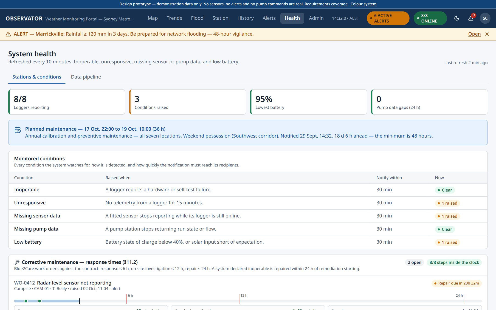

**Health** refreshes every 10 minutes and answers "is everything working?":

- **Monitored conditions** — inoperable, unresponsive, missing sensor data, missing
  pump data and low battery, each showing *Clear* or *raised*.
- **Availability** — a strip per logger for the last 24 hours. Green is reporting,
  amber is a sensor not reporting, grey is the logger silent. Hover a block for its time and cause.
- **Redundancy** — which backup source takes over if a sensor fails, and how the alert wording changes.
- **Conditions raised**, **data quality** (readings held back as suspect), **calibration**
  due dates, and **power** for every logger.

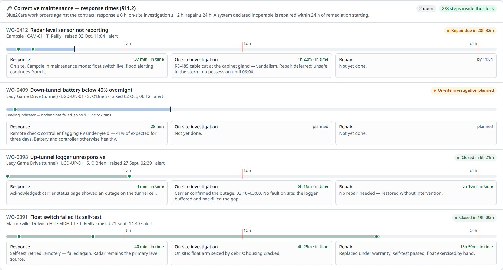

**Corrective maintenance** tracks each fault as a work order against the agreed
response times — response within 6 hours, on-site investigation within 12, repair
within 24 — with each step's time and notes.

The **Data pipeline** tab shows how data travels from the field to the portal, with today's counts.

## Administration

**Admin** in the menu is for administrators. It has seven pages: Users, Roles, Alert
rules, Sensors, Recipients, Audit trail, and System & contract.

### Users

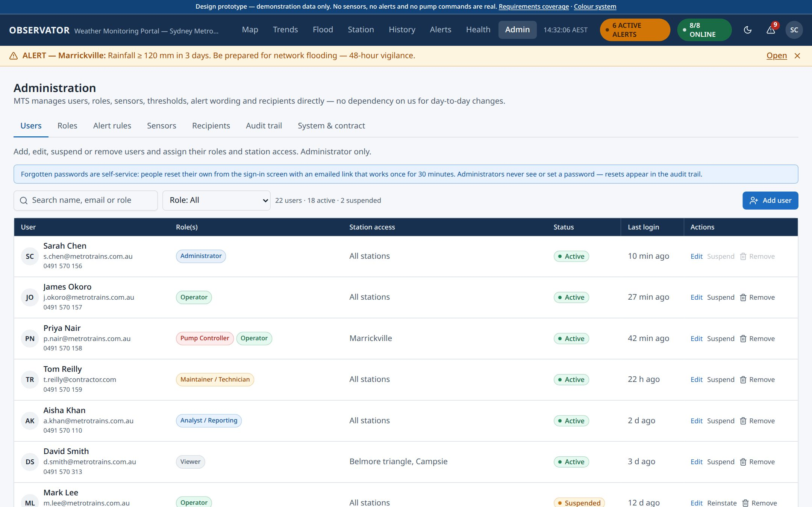

- **Add user** — enter the name, email and mobile number, choose one or more roles and
  which stations they can see. They receive an invitation and set their own password.
- **Edit** — change roles, station access or contact details. Changes apply at once.
- **Suspend** — block sign-in but keep the person's history. **Reinstate** reverses it.
- **Remove** — delete the account (its history stays in the audit trail).

Administrators never set or see passwords. People reset their own (see *Forgotten your password*).

### Roles

Six standard roles are provided (see *Who can do what*). Select **New role** to create
your own, choosing exactly which permissions it carries.

### Alert rules

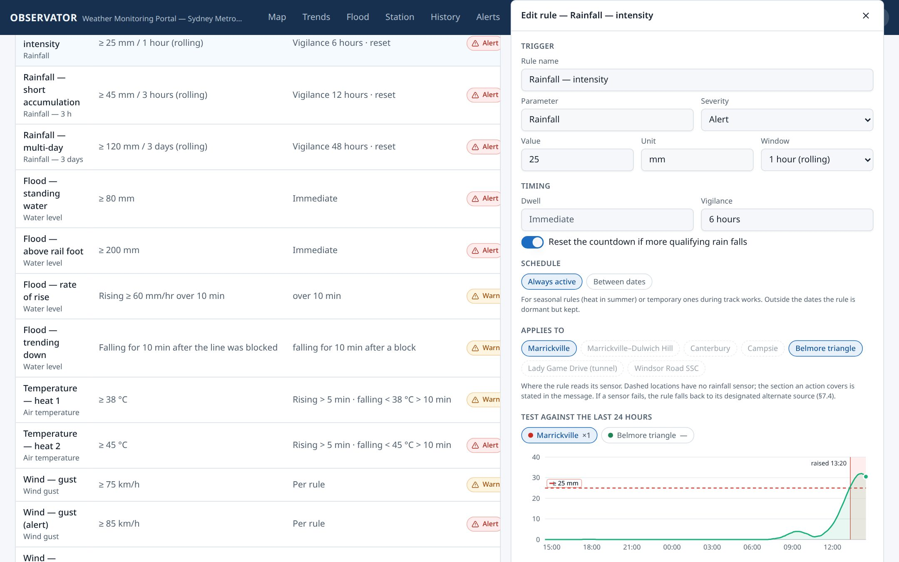

Every alert threshold, timer, message and recipient is a setting here — no software change is needed.

- Use the switch on a row to turn a rule **on or off**.
- Select **Edit** to change a rule: the threshold and time window, how long a reading
  must last before alerting, the countdown after it clears, dates it is active (for
  example summer only), the locations it covers, the **message** (with a preview of what
  people receive), and who gets it.
- Select **New rule** to add one.

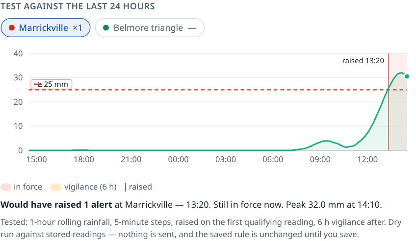

**Test against the last 24 hours** shows, before you save, when your changed rule
*would* have fired at each location. Use it to check a new threshold is right.

Every saved change creates a new **version**. **Version history** shows who changed
what, and **Restore** brings back an earlier version.

### Sensors

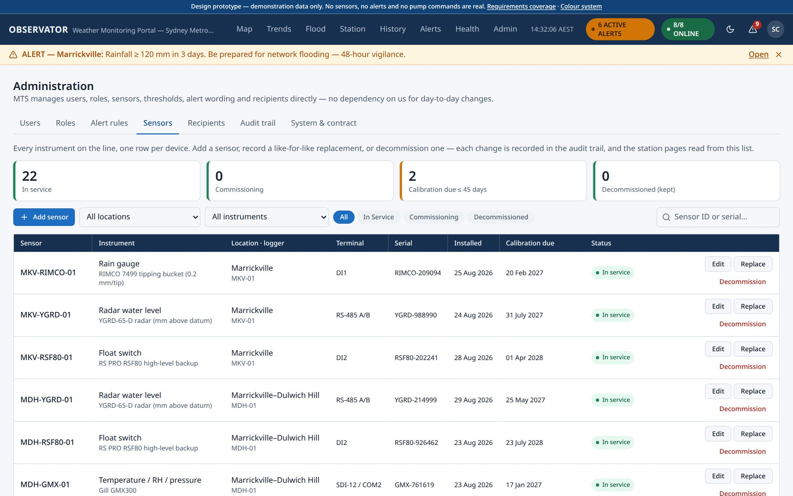

**Sensors** lists every instrument on the line with its location, logger connection,
serial number, install date, calibration due date and status.

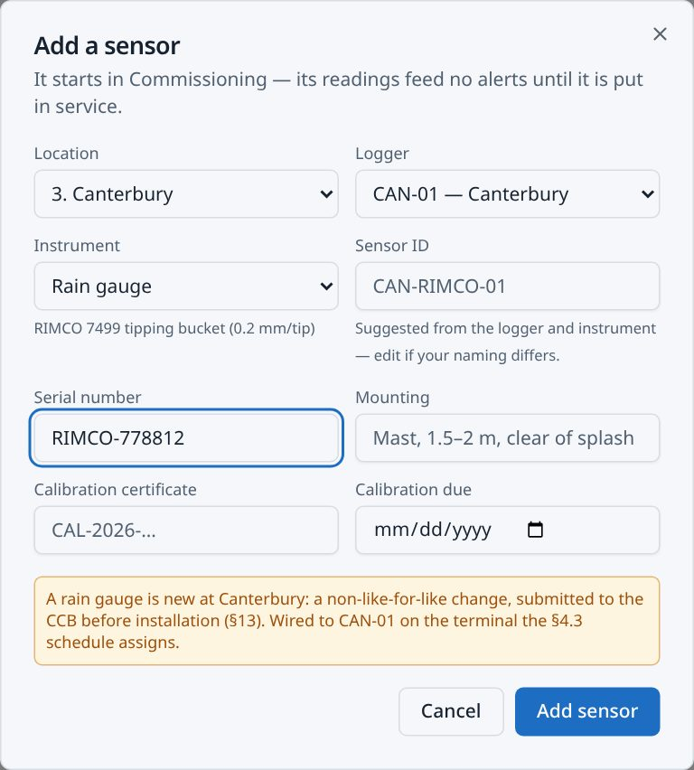

- **Add sensor** — choose the location, logger and instrument type, then enter the
  serial number (and calibration certificate if you have it). A new sensor starts as
  **Commissioning**: it raises no alerts until you select **Put in service**.
- **Edit** — correct the details.
- **Replace** — record a like-for-like replacement with its new serial number. The sensor keeps its ID and history.
- **Decommission** — retire a sensor, with a reason. It stays on the list for its history.

Station pages read their equipment list from here.

### Recipients

Who receives which alerts, and by which channel (on screen, email, web push), by group and by person.

### Audit trail

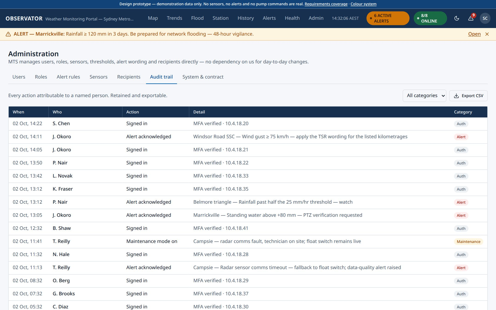

A permanent record of who did what and when: sign-ins and password resets, users and
roles changed, rule edits, sensor changes, alerts acknowledged, maintenance mode and every
manual pump command. Filter by category and select **Export CSV**.

### System & contract

A summary of the installed system: the sensors at each location, how the system was
delivered, the maintenance and response commitments, and safety and governance.

## Your settings

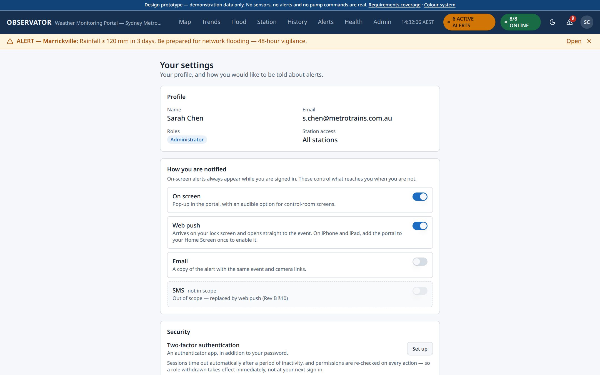

Open from your **initials → Profile & notifications**:

- **Notification preferences** — which alerts you receive, and how (on screen, email, web push).
- **Security** — set up **two-factor authentication** with an authenticator app.
- **Display** — how the portal uses colour. Light or dark is the moon / sun button in the top bar.

For your security, you are warned and then signed out after a period of inactivity.

### Using a phone

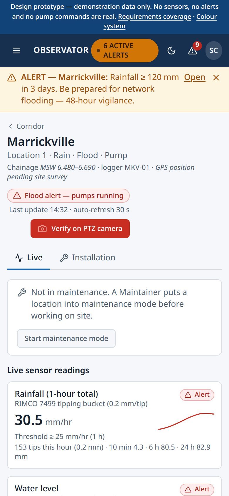

Every page works on a phone. Pages reflow into a single column, tables scroll sideways,
and the pump controls come straight after the readings so they are quick to reach.

## Who can do what

| Role | Typical user | Can |
|---|---|---|
| **Administrator** | System owner / IT | Everything: users, roles, alert rules, recipients, sensors, and all viewing and control |
| **Operator** | Operations control room | View everything, receive and acknowledge alerts, start operational responses |
| **Pump Controller** | Authorised operations staff | Everything an Operator can, plus manual pump start/stop at permitted stations |
| **Maintainer / Technician** | Field and maintenance | Equipment and power health, calibration, maintenance mode, maintenance alerts |
| **Analyst / Reporting** | Engineering and reporting | History, trends and CSV export; no control |
| **Viewer** | Stakeholders | View only — no actions or changes |

A person can hold more than one role, and can be limited to particular stations.

## Quick answers

**I forgot my password.** Select *Forgot your password?* on the sign-in screen. The link comes to your email and works once for 30 minutes.

**I'm locked out after wrong passwords.** Wait 15 minutes, or reset your password.

**How do I stop a red alert showing as new?** Open *Alerts* and select *Acknowledge*. Your name and the time are recorded.

**The camera window keeps appearing.** It is asking someone to confirm standing water. Check the feed and acknowledge, or snooze it for 10 minutes.

**How do I get data into Excel?** Use *History*, run your query and select *Export CSV*. Every chart's download icon also exports just that chart.

**A station shows grey or "no data".** The sensor or logger is not reporting. *Health* shows since when, and whether a work order is open.

**How do I add a new sensor?** *Admin → Sensors → Add sensor*. It starts in Commissioning; put it in service once it has been checked.

**Who changed this rule?** *Admin → Alert rules → Version history*, or the *Audit trail*.

### Reviewing the prototype — demo time

Because the prototype uses demonstration data, it opens at **14:32 during a storm at
Marrickville**. The **demo time** button at the bottom right plays the storm forward
(×10, ×60) or **jumps** straight to key moments — the pumps starting, the line blocked,
the camera check, the water falling and the all-clear. **Back to 14:32** starts again.
This control exists only in the prototype.

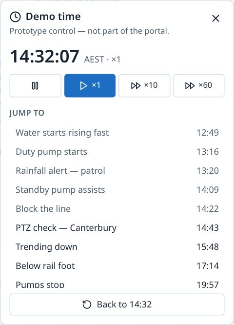
