# Installing the Weather Station — step by step

**Observator Weather Station 1.0.2** — installing it on the station PC with the setup program.

This is the picture-by-picture walk through the setup program. It takes about 15
minutes. You install it once, on the one PC that will be the station's server; every
other computer just opens the portal in a web browser.

---

## Contents

1. [Before you start](#before-you-start)
2. [Start the setup program](#step-1-start-the-setup-program)
3. [The program folder](#step-2-the-program-folder)
4. [The data folder](#step-3-the-data-folder)
5. [The first administrator](#step-4-the-first-administrator)
6. [The sensor and the network](#step-5-the-sensor-and-the-network)
7. [Install](#step-6-install)
8. [The administrator's password](#step-7-the-administrators-password)
9. [Setup finishes the work](#step-8-setup-finishes-the-work)
10. [Done](#step-9-done)
11. [Open the portal](#open-the-portal)
12. [Point the sensor at the PC](#point-the-sensor-at-the-pc)
13. [If setup stops](#if-setup-stops)

---

## Before you start

| You need | Why |
|---|---|
| **Windows 10 or 11, 64-bit** (or Server 2019/2022) | The software is built for it |
| **An administrator account** on the PC | Setup installs Windows services and firewall rules |
| **4 GB of memory and 20 GB free disk** | Readings are never deleted, so the data grows slowly — about 0.5 GB a year |
| **A fixed IP address** for the PC | The sensor's converter, and everyone's browser, find the PC by it |
| **The PC set never to sleep**, and Windows time sync on | Every reading is time-stamped by this PC's clock |
| `observator-weather-1.0.2-setup.exe` | The setup program. No internet is needed, now or later |

**Find the PC's IP address** — you will need it for the converter and for the
portal's address. Press the Windows key, type `cmd`, press Enter, then type
`ipconfig` and press Enter. The line **IPv4 Address** is the one, for example
`192.168.1.20`.

---

## Step 1: Start the setup program

Double-click `observator-weather-1.0.2-setup.exe`. Windows asks whether to let it
make changes — choose **Yes**. The wizard opens.

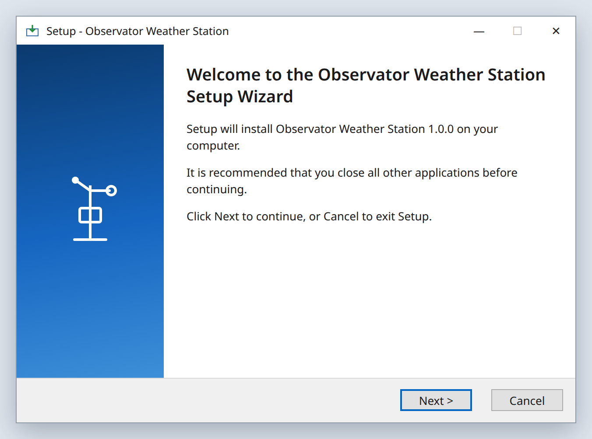

Select **Next**.

---

## Step 2: The program folder

Where the program itself goes. Keep the default, `C:\Observator`.

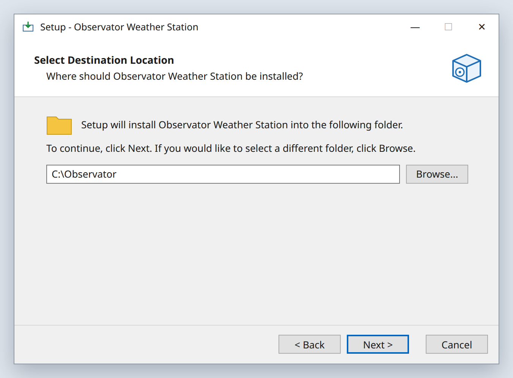

Select **Next**.

---

## Step 3: The data folder

Where the readings, settings, logs and backups are kept. Keep the default,
`C:\ObservatorData`.

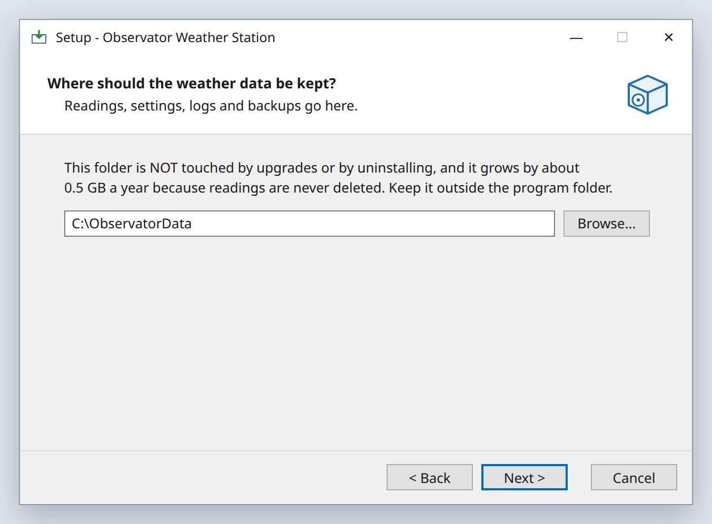

This folder is never touched by upgrades or by uninstalling, so the readings are safe.
It must not be inside the program folder — setup refuses if it is.

Select **Next**.

---

## Step 4: The first administrator

Type the **email address** of the person who will sign in first and set everyone else
up. It does not have to be a real mailbox — the PC sends no email — but it is what you
type to sign in.

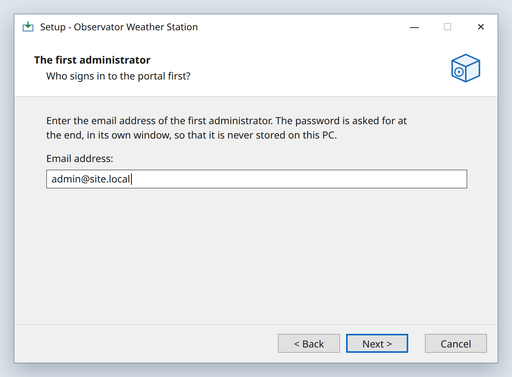

There is no password here on purpose: it is asked for at the end, in its own window,
so it is never written down anywhere on the PC.

Select **Next**.

---

## Step 5: The sensor and the network

How the GMX551's readings reach this PC. **For most sites, change nothing.**

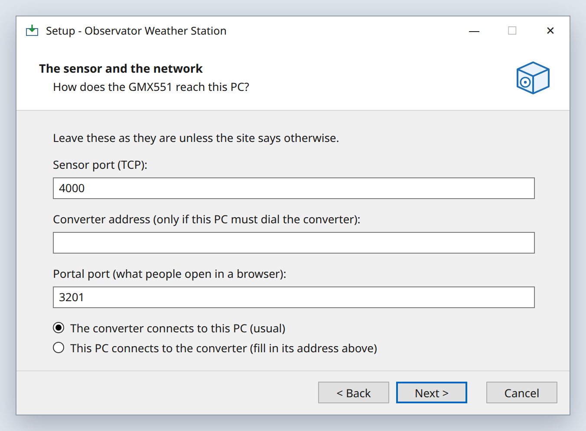

| Setting | What to put |
|---|---|
| **Sensor port** | `4000`. The converter sends the readings to this port |
| **Converter address** | Leave it **empty** — unless you choose the second option below |
| **Portal port** | `3201`. People open `http://<this PC's IP>:3201` in a browser |
| **The converter connects to this PC (usual)** | Choose this. You then set the converter to send to *this PC's IP*, port 4000 — see [Point the sensor at the PC](#point-the-sensor-at-the-pc) |
| **This PC connects to the converter** | Only if the converter can only wait to be called. Then type the **converter's** IP address in *Converter address* |

Select **Next**.

---

## Step 6: Install

The wizard shows where it will install.

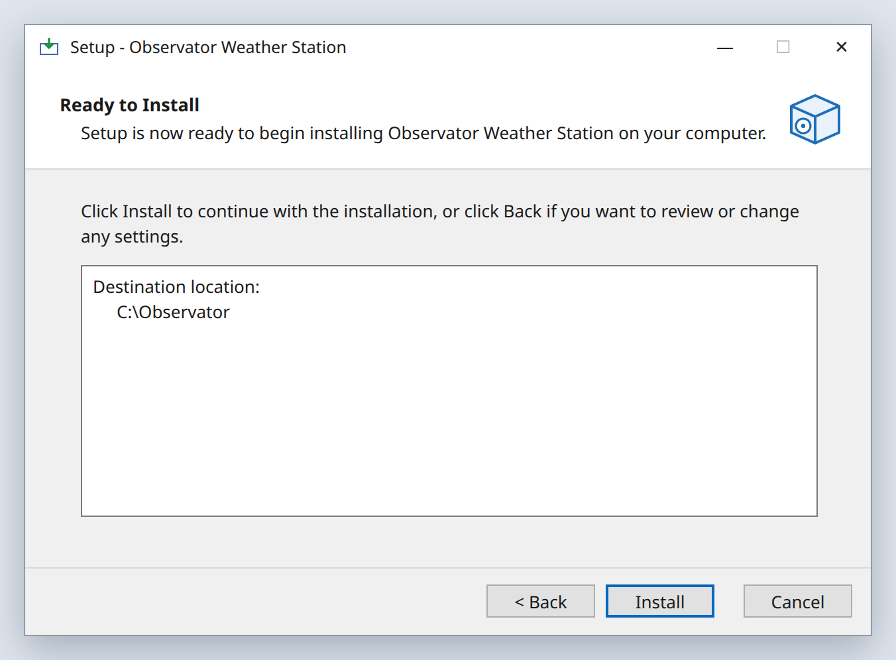

Select **Install**. It copies the program — this takes a minute or two.

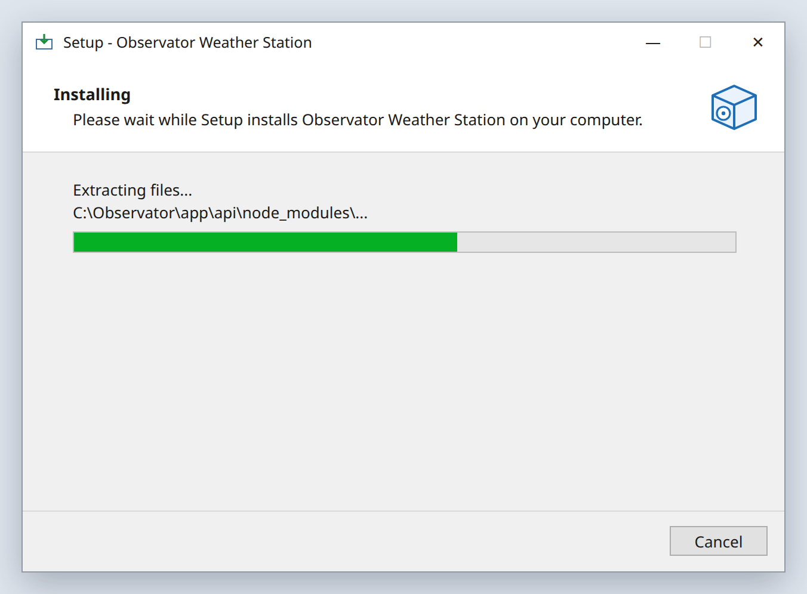

---

## Step 7: The administrator's password

A blue **PowerShell** window opens. It checks the PC, then asks for the first
administrator's **password**: at least **8 characters**, typed **twice**.

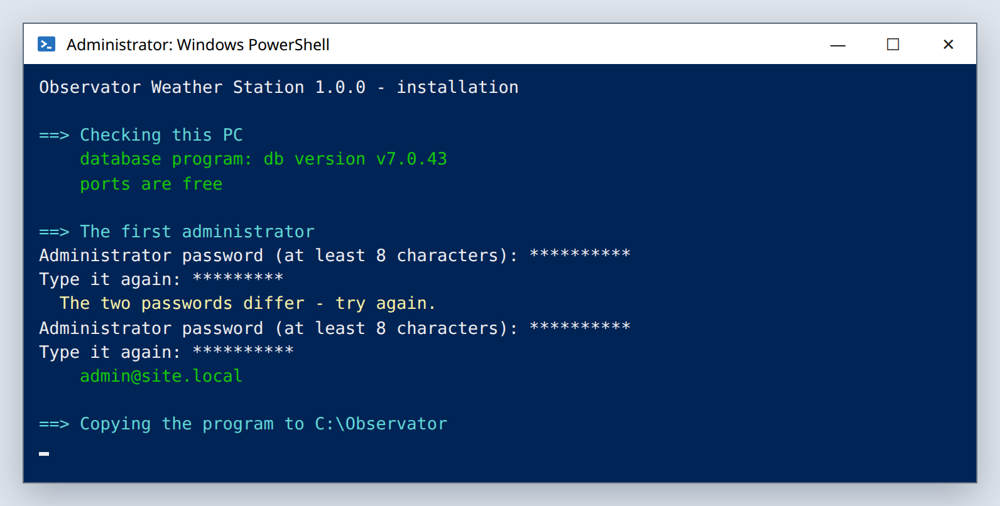

- Nothing appears on screen while you type — only stars. That is normal.
- If the two do not match, or it is too short, it says so in yellow and simply asks
  again. Nothing is lost.
- **Write the password down** somewhere safe. You sign in to the portal with this
  email and password.

---

## Step 8: Setup finishes the work

The same window carries on by itself. Each step shows in turquoise, and each thing
done in green.

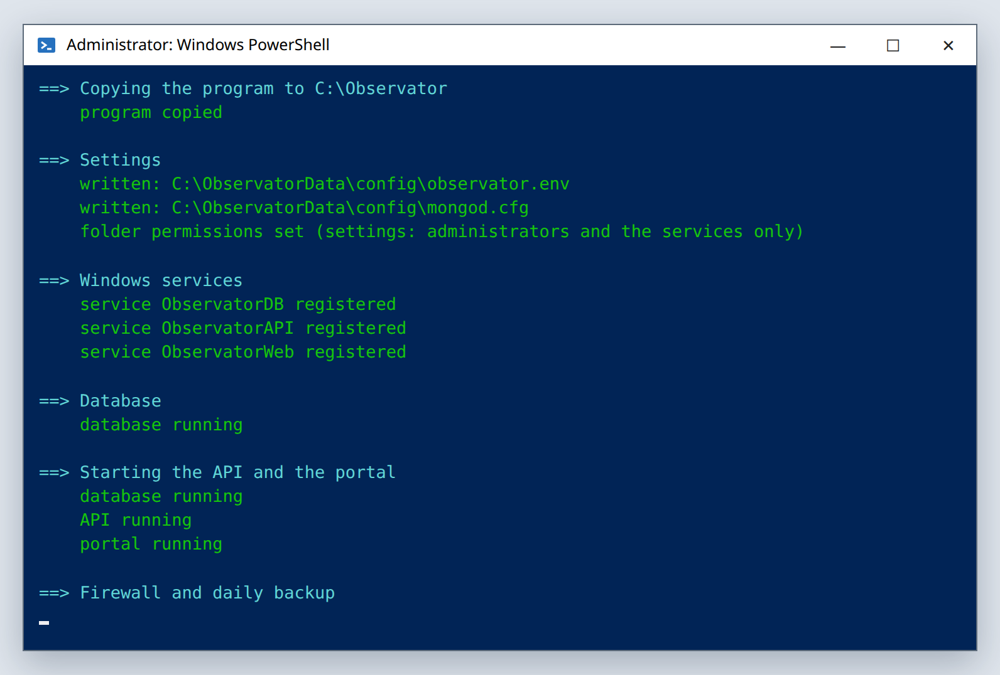

It copies the program, writes the settings, creates three Windows services (the
database, the API and sensor stream, and the web portal), starts each one and checks it
answers, opens the two ports in the Windows firewall for the local network, and
schedules the nightly backup.

When it is finished the window **closes by itself**. Do not close it yourself while it
is working.

---

## Step 9: Done

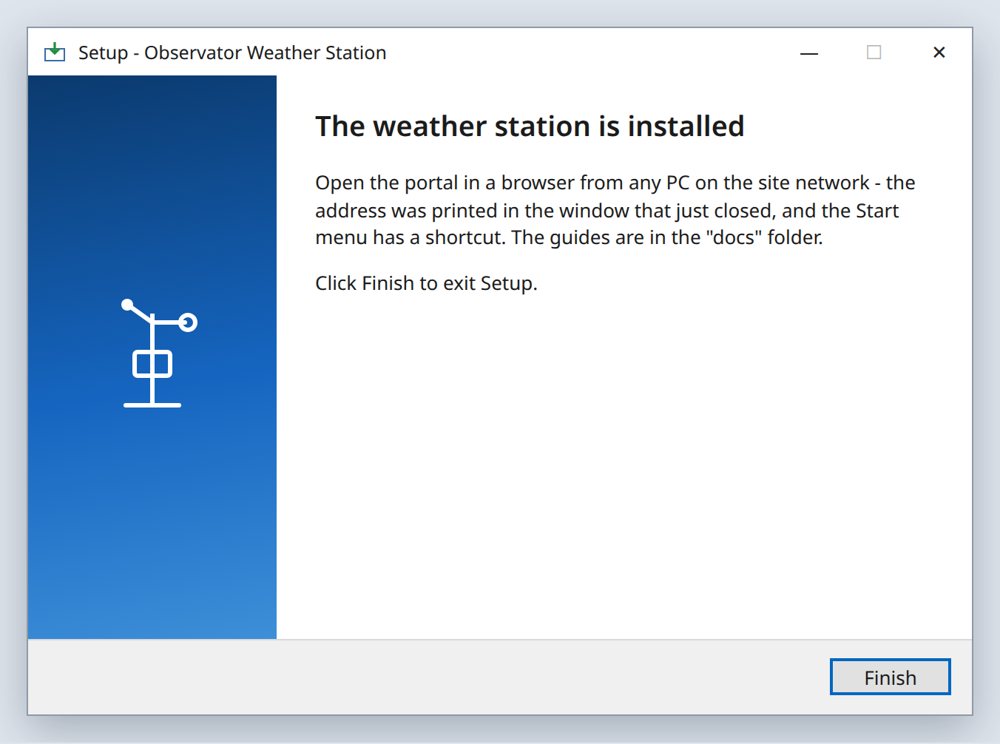

Select **Finish**. The setup program can now be deleted; the software is in
`C:\Observator` and starts by itself whenever the PC starts.

---

## Open the portal

On the station PC, or on any computer on the same network, open a web browser and go
to

`http://<this PC's IP address>:3201` — for example `http://192.168.1.20:3201`

On the station PC itself, `http://localhost:3201` works too, and the Start menu has a
**Weather station portal** shortcut.

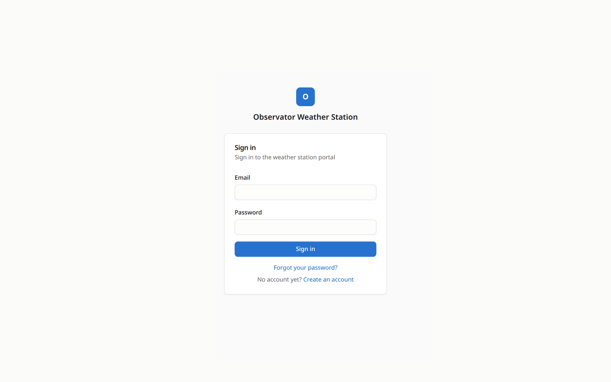

Sign in with the **email** from step 4 and the **password** from step 7.

Then open **System** in the menu. Everything should be green except the **sensor
stream** (until the converter is set up, next) and the **backup** (until the first
night).

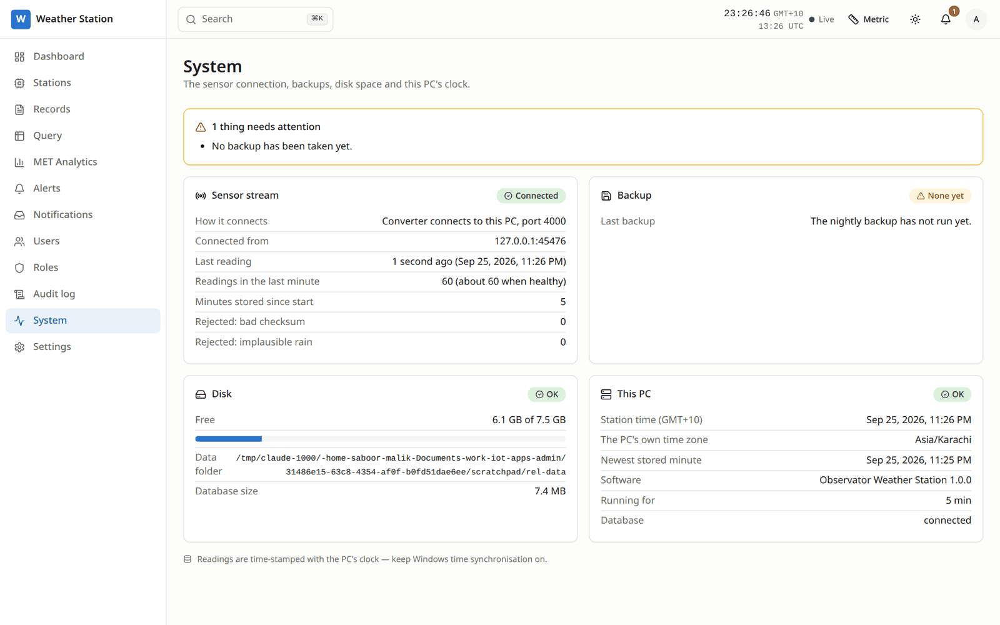

---

## Point the sensor at the PC

The GMX551 is wired to a serial-to-network converter. In the converter's own settings
page:

| Setting | Value |
|---|---|
| Mode | **TCP Client** (sometimes called *active* or *connect* mode) |
| Destination IP | **This PC's IP address** — for example `192.168.1.20` |
| Destination port | **4000** |
| Serial | Must match the GMX551: Gill's default is **19200 baud, 8 data bits, no parity, 1 stop bit** (a sensor set to NMEA usually uses **4800** or **9600** baud) |

The sensor may send Gill's ASCII format (its default) or **NMEA 0183** — the software
reads both, with nothing to set.

Within a minute **System** shows the sensor stream as *Connected*, with about 60
readings a minute, and the wind dial on the **Dashboard** starts moving every second.

**If the converter can only be a TCP Server**, the PC calls it instead. Set the
converter to **TCP Server** on port 4000, then in the portal open **System → Sensor
stream → Change connection**, choose **This PC connects to the converter**, type the
converter's IP address and port, and select **Save and connect**. The window shows at
once whether the converter answered. You can switch back the same way; nothing needs
reinstalling.

---

## If setup stops

If something is wrong, the PowerShell window does not close: it shows **SETUP
STOPPED** in red, with the reason underneath, and waits.

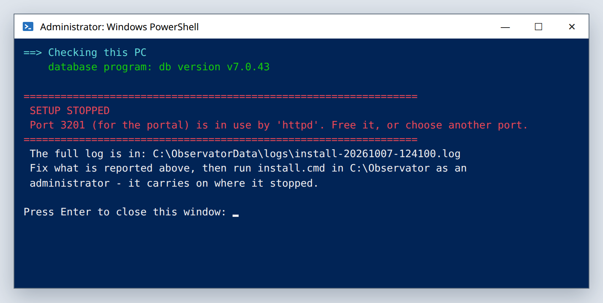

**First, read the red line** — it says what is wrong. Take a photo of the window if
you need help.

**Then press Enter** to close it. The wizard shows this message:

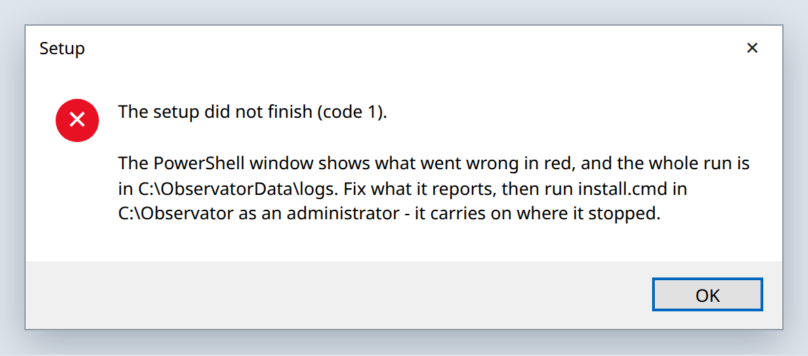

**Last, fix what the red line said** and finish the install without starting again:
open `C:\Observator`, right-click `install.cmd` and choose **Run as administrator**.
It carries on from where it stopped — the settings you already chose are kept.

Every run is also written down in `C:\ObservatorData\logs\install-<date>-<time>.log` —
send that file if you ask us for help.

| The red line says | What to do |
|---|---|
| *Port 3201 (for the portal) is in use by …* | Another program uses that port. Stop it, or run the setup again and choose another portal port |
| *Port 4000 (for the sensor stream) is in use by …* | The same, for the sensor port |
| *The database program cannot run on this PC … lacks AVX* | The PC's processor is too old for the database. Use a newer PC |
| *The database / API / portal did not start. See …* | Send us the file it names (in `C:\ObservatorData\logs`) |
| *Windows will not let setup open its own settings …* | Send us the install log from `C:\ObservatorData\logs` — it lists the permissions Windows reported |
| *Already installed in …* | It is already installed. To update it, use the new release's `upgrade.cmd` |

---

*Observator Weather Station 1.0.2. Day-to-day use of the portal is in the User Guide;
looking after the PC (status, backups, upgrades, passwords) is in OPERATIONS.md.*
