# Weather Station Portal — User Guide

**Observator Weather Station** — the software running on the station PC at your site.

Everything here happens in a web browser. Open the address your administrator gives
you — for example `http://station-pc:3201` — from any computer on the site network.
Nothing is installed on your machine, and nothing needs the internet.

---

## Contents

1. [Signing in](#1-signing-in)
2. [Getting around](#2-getting-around)
3. [Dashboard](#3-dashboard)
4. [Query — tables and CSV](#4-query--tables-and-csv)
5. [Records](#5-records)
6. [MET Analytics](#6-met-analytics)
7. [Alerts and notifications](#7-alerts-and-notifications)
8. [The station](#8-the-station)
9. [System — is everything working?](#9-system--is-everything-working)
10. [People and roles](#10-people-and-roles)
11. [Settings](#11-settings)
12. [Who can do what](#12-who-can-do-what)
13. [Common questions](#13-common-questions)

---

## 1. Signing in

Enter your email and password and select **Sign in**.

| What you might see | What it means |
|---|---|
| **Forgot your password?** | There is no email on this PC, so ask an administrator. They set you a temporary password (Users → Reset password) and you choose your own next time you sign in |
| **"Choose your own password"** | An administrator has just set your password. Enter the one they gave you, then your own twice |
| **"Waiting for an administrator to approve it"** | You asked for an account and nobody has approved it yet |
| **Too many attempts** | Sign-in allows ten tries a minute from each PC. Wait a minute |
| **Create an account** | Only shown if your site allows people to ask for one. An administrator still has to approve it |

You are signed out after 30 minutes without activity. A dashboard left up on a wall
screen stays signed in, because it refreshes every minute.

---

## 2. Getting around

**The menu, on the left,** lists only what your role allows — see
[Who can do what](#12-who-can-do-what).

**The top bar** is the same on every screen:

| Item | What it does |
|---|---|
| **Search** (Ctrl+K) | Jump to any screen or record by typing |
| **Clock** | The **station's** local time, with UTC beneath — never your own PC's time |
| **Live** | Green while readings are arriving |
| **Metric** | The units readings are shown in |
| **Sun / moon** | Light or dark theme |
| **Bell** | Unread alerts |
| **Your initials** | Your profile, and **Sign out** |

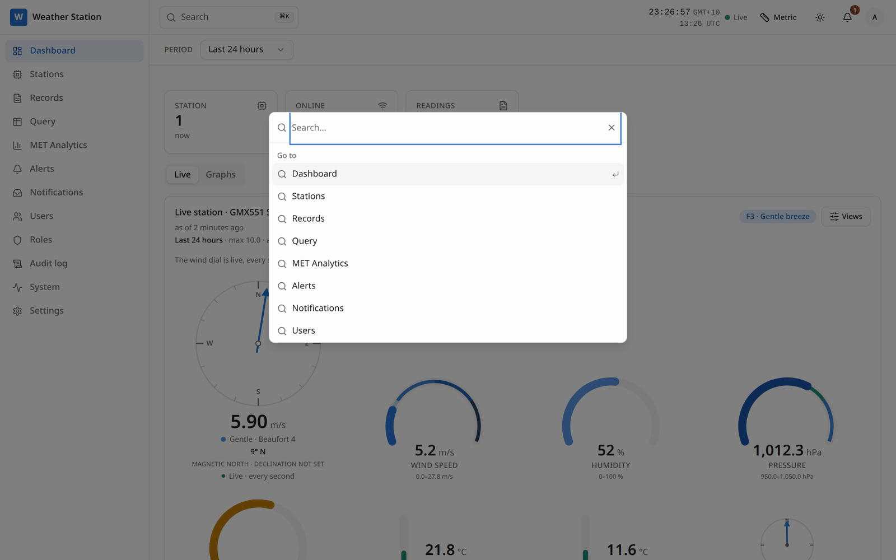

**The period**, under the top bar on the Dashboard and Records, sets how far back
those screens look. If a screen looks empty, widen it. There is no station picker:
this PC has one station, so there is nothing to choose between.

---

## 3. Dashboard

What the station is doing right now.

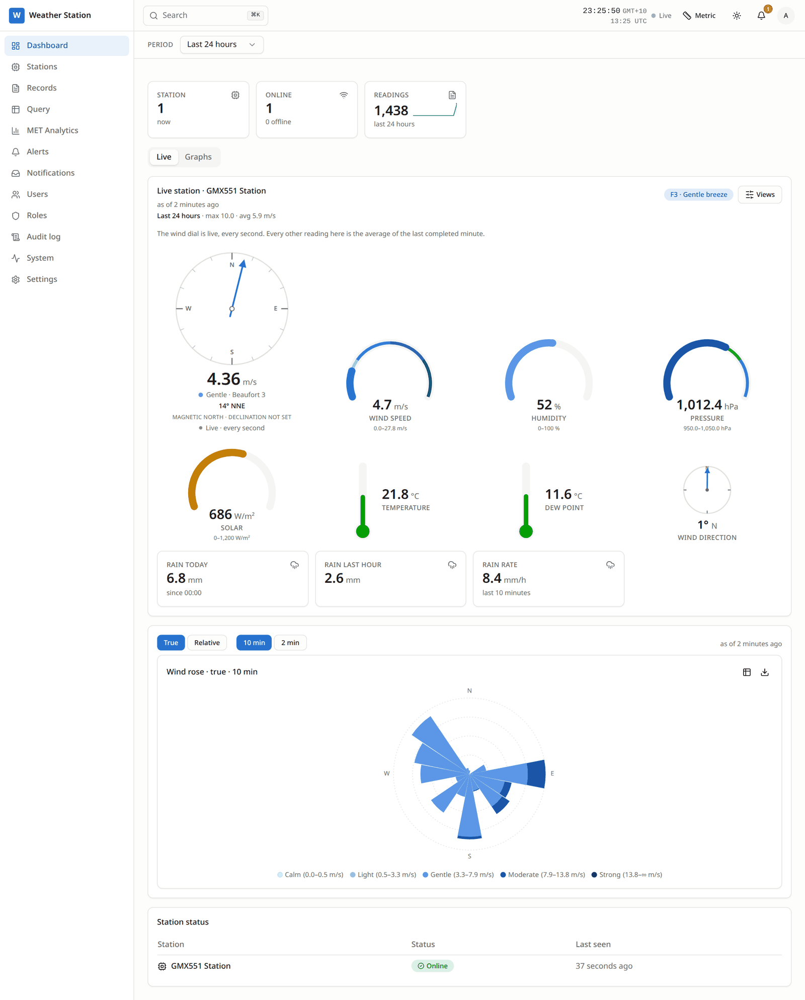

**The three tiles** — the station, whether it is online, and how many readings have
arrived in the period.

**The live panel.** The **wind dial** moves **every second**, straight from the
sensor; the caption says so. Everything around it — wind speed, humidity, pressure,
solar, temperature — shows the **average of the last completed minute**, which is what
gets stored. The two legitimately differ, and that is not a fault: the dial is this
second, the gauges are the last minute.

- **F4 · Moderate breeze** — the Beaufort force in plain words.
- **Relative to mast · uncalibrated** — the mast's heading has not been entered, so
  directions are relative to the mast rather than true north. An administrator sets it
  on the station.
- **Rain today** — since the start of the rain day (midnight, or 09:00 if your station
  uses the Bureau's rain day; the tile says which). **Rain last hour** is the last 60
  minutes, **Rain rate** is mm per hour over the last 10 minutes.

**The wind rose** shows which directions the wind came from and how hard it blew.
**True / Relative** switches the reference, **10 min / 2 min** the averaging. The two
icons in its corner show the numbers as a table, or download them.

**Graphs** plots the same readings over the chosen period.

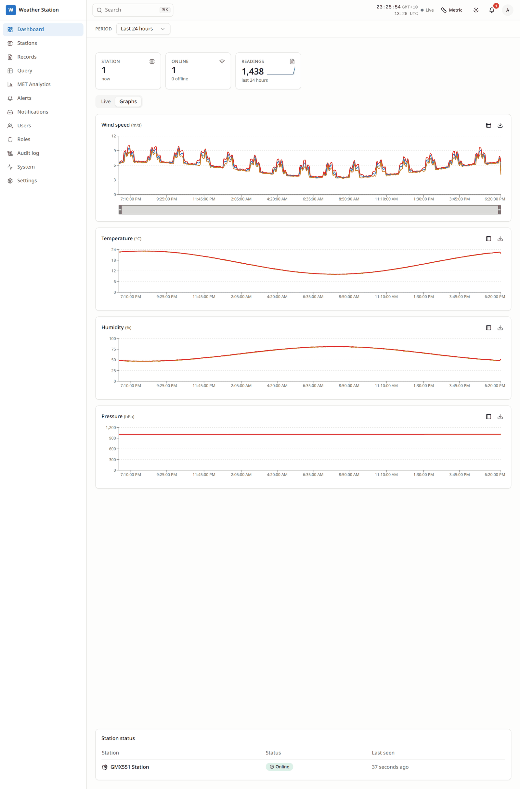

---

## 4. Query — tables and CSV

The screen for getting data out.

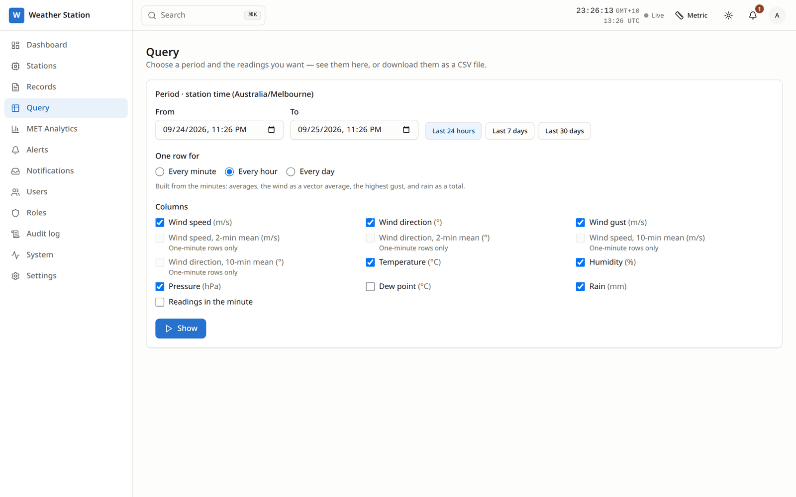

1. **Period.** *From* and *To* are in the **station's** time, whatever PC you are on.
   Or use *Last 24 hours / 7 days / 30 days*.
2. **One row for** — every minute (exactly as stored), every hour, or every day.
   Hours and days are built from the minutes: averages, wind direction as a proper
   vector average (350° and 10° average to north, not south), the highest gust, and
   rain as a total. A day starts at the station's rain-day hour.
3. **Columns** — tick what you want. The 2- and 10-minute wind means only make sense
   for one-minute rows, so they grey out otherwise.
4. **Show** fills the table, a page at a time.

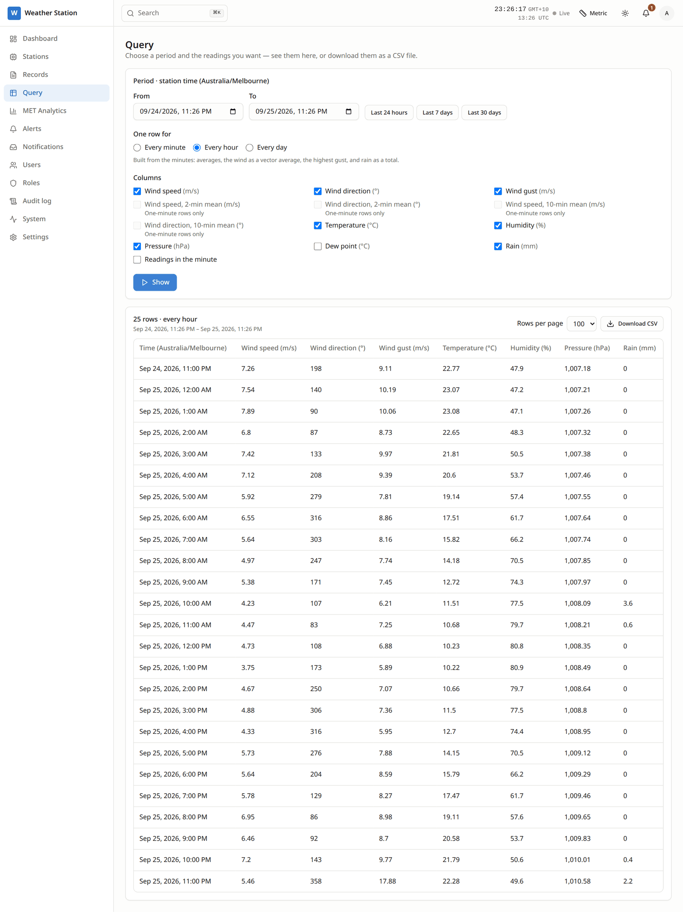

**Download CSV** saves the whole query — every page, not just the one on screen — with
two time columns (station time and UTC) and the units in the headings. The file is
named after the station and the dates, in station time.

---

## 5. Records

A **record** is the station's data for one day.

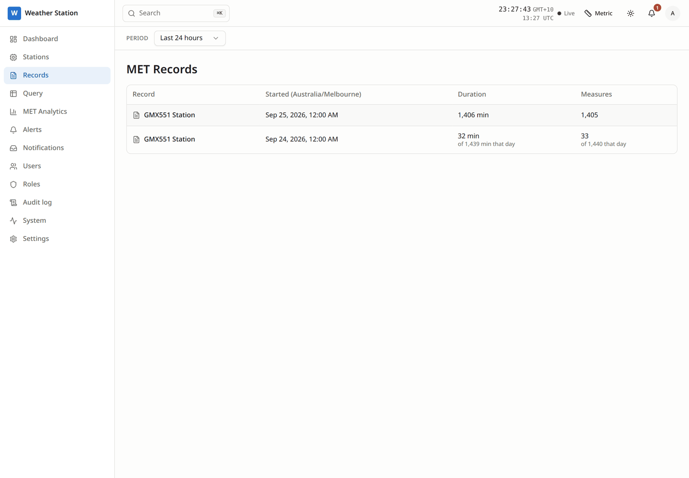

Open one for a chart of up to five readings together, the minute-by-minute table, and
**Export**.

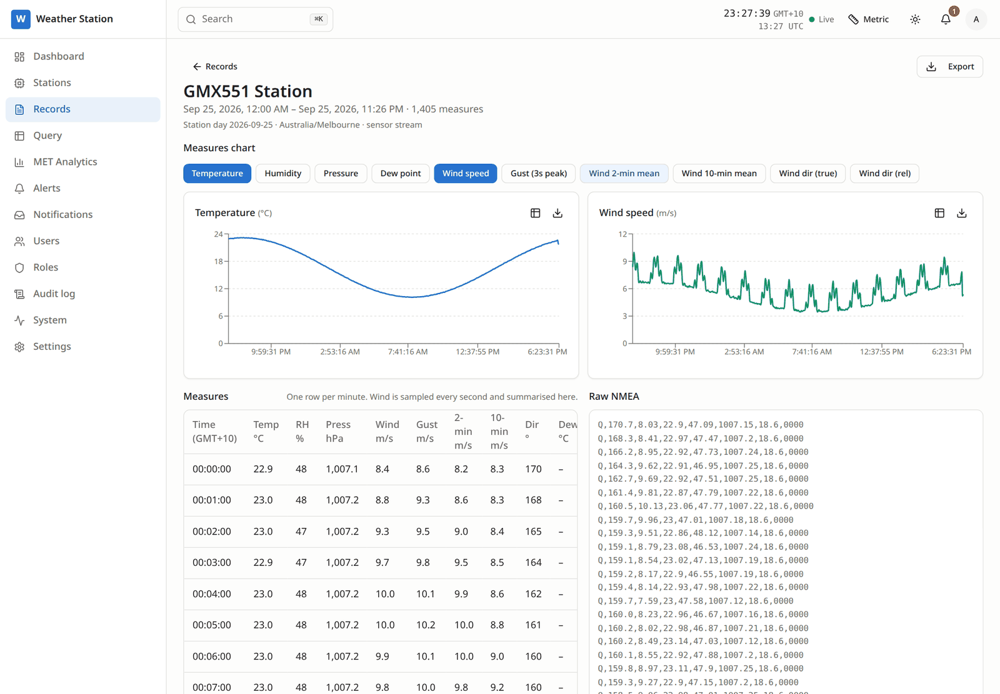

In the table, **QC** marks a reading that failed a quality check — hover to see why.
An asterisk on a 10-minute value means fewer than ten minutes went into it. **Raw
NMEA** on the right shows the sensor's own lines, exactly as they arrived.

---

## 6. MET Analytics

Longer-range analysis of the whole period you choose at the top.

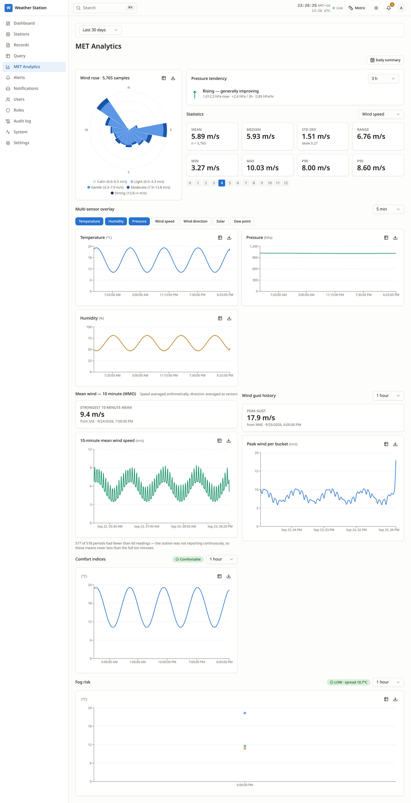

- **Wind rose** over the whole period, and **pressure tendency** — rising, falling or
  steady, which is what tells you what the weather is about to do.
- **Statistics** for any reading: mean, median, spread, the value 90% and 95% of
  readings stayed under, and how long the wind spent at each Beaufort force.
- **Multi-sensor overlay** — several readings on one time axis.
- **Mean wind — 10 minute (WMO)** and **wind gust history**, the two figures aviation
  and marine users ask for, with the strongest of each called out.
- **Comfort indices** (heat index / wind chill) and **fog risk** from the spread
  between temperature and dew point.
- **Daily summary** — one row per day.

Where a figure is built from fewer readings than it should be, the screen says so
rather than quietly averaging less data.

---

## 7. Alerts and notifications

An **alert rule** watches one reading and tells you when it crosses a line you set.

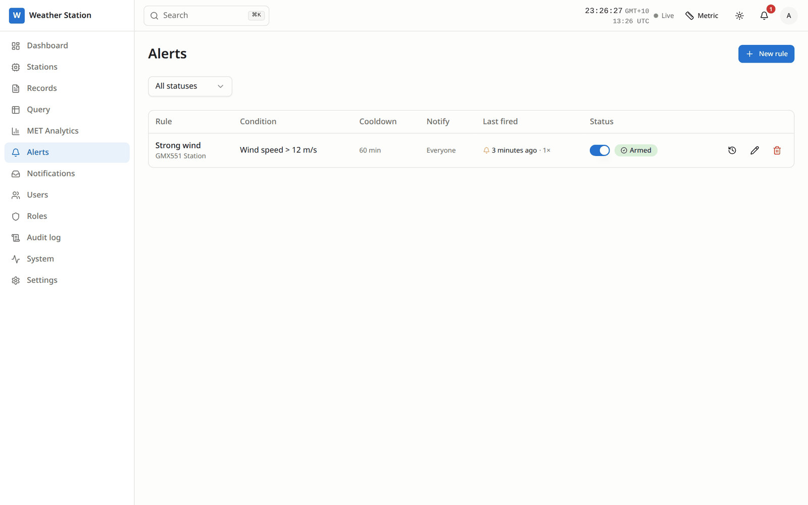

**New rule** asks for a name, the reading to watch, the comparison and threshold, a
cooldown, and who to notify.

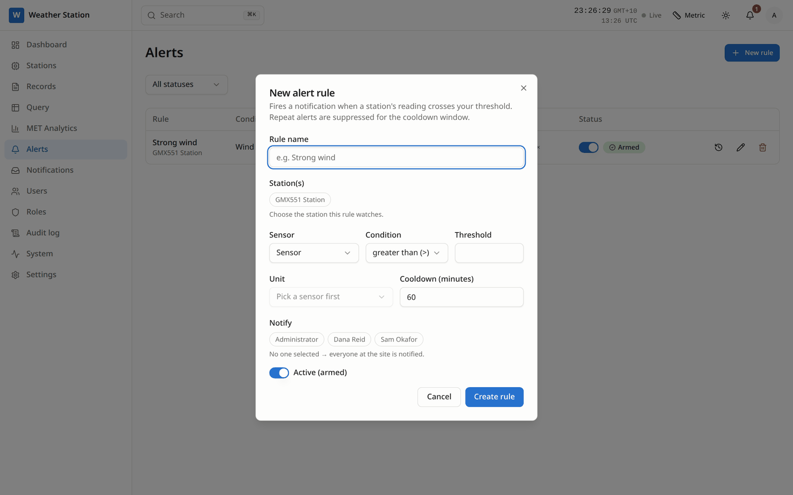

- A rule fires on the **highest** reading in a minute for an "above" rule (and the
  lowest for a "below" one), so a gust cannot slip between two averages. The alert says
  so — *"peaked at 14.2 m/s in that minute"* — which is why its number can be higher
  than the average on the dashboard for the same minute.
- **Cooldown** stops one windy afternoon filling the screen with the same alert.
- Rules can be paused, and their history is kept.

When a rule fires it appears under the **bell** and on **Notifications**.

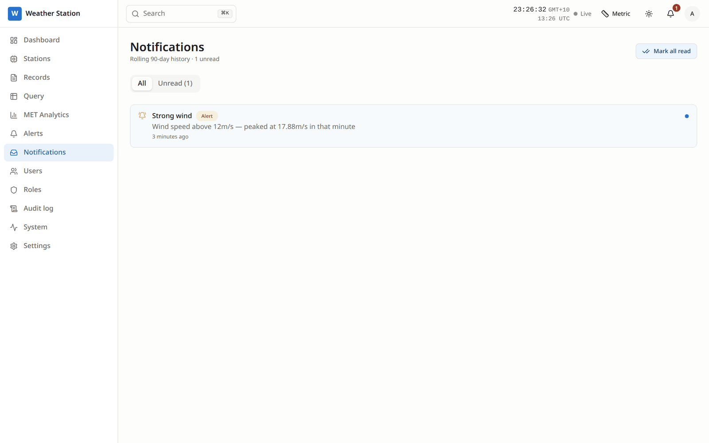

Alerts live in the portal. This PC has no internet and sends no email — by design.

---

## 8. The station

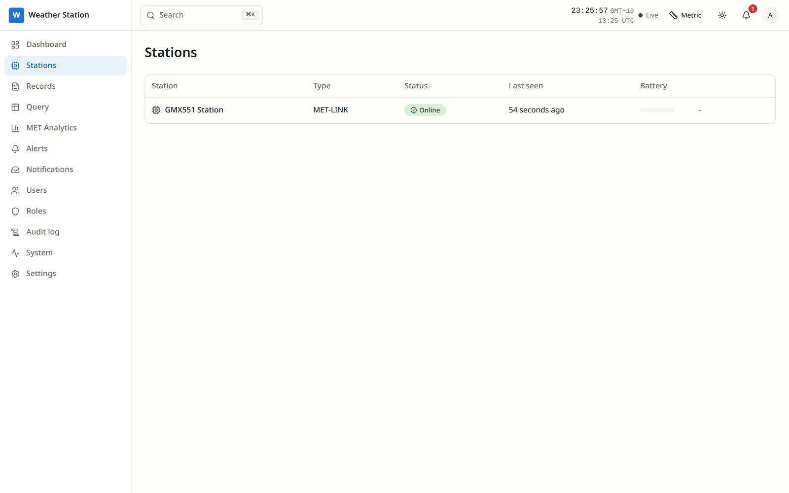

Whether the station is reporting, and when it was last heard from. Open it for its
details and recent readings.

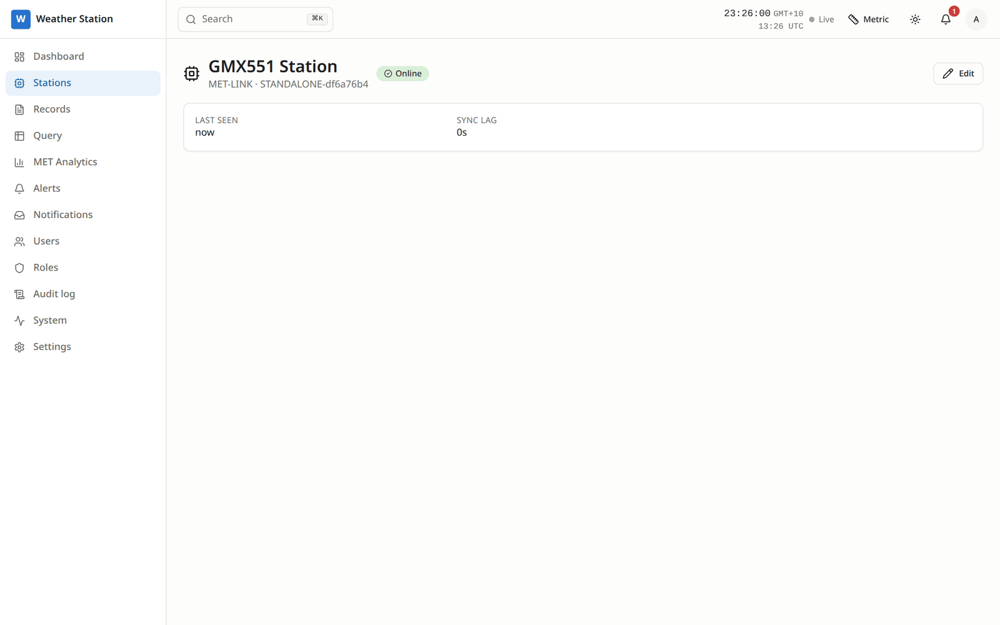

Administrators can **Edit** it:

| Setting | Why it matters |
|---|---|
| **Display name** | What the station is called throughout the portal |
| **Rain day starts at** | 00:00, or 09:00 for the Bureau of Meteorology rain day. It decides what "rain today" and each daily total mean |
| **Mast heading offset** | Degrees added to the sensor's bearing to give true north. Until it is set, the dial says directions are relative to the mast |
| **Keep raw per-second samples** | Off by default. Turn it on to commission the site or chase a fault, then off again |

---

## 9. System — is everything working?

For administrators and operators. The first screen to open when something looks wrong.

- **Sensor stream** — connected or not, where from, the last reading, readings in the
  last minute (about 60 when healthy), and anything rejected for a bad checksum or an
  impossible rain value.
- **Backup** — when the nightly backup last ran and whether it worked.
- **Disk** — free space. Readings are never deleted, so the disk is the limit.
- **This PC** — the station's time, this PC's own time zone, the newest stored minute,
  and how long the software has been running.

Anything needing attention is listed at the top. Tell whoever looks after the PC.

> Every reading is time-stamped by **this PC's clock** — the sensor has none of its
> own. If the clock is wrong, the readings are wrong, so leave Windows time
> synchronisation on.

---

## 10. People and roles

*Administrators only.*

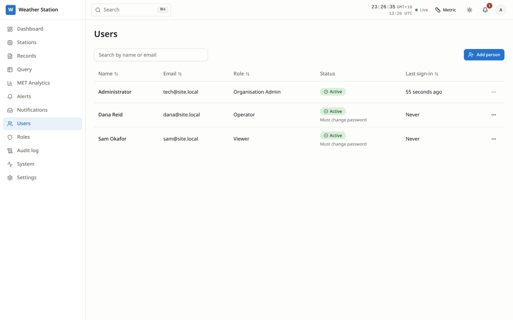

**Add person** takes an email, a password (the wand suggests a strong one) and a role.
Pass the password on yourself — there is no email from this PC — and they must choose
their own the first time they sign in.

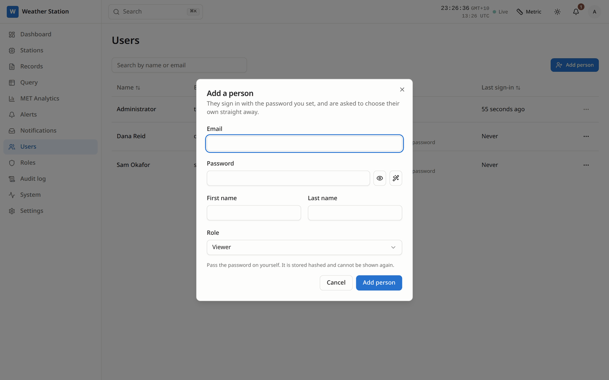

The **⋯** menu on each person: change their role, reset their password, deactivate them
(blocks sign-in at once, keeps their history), or remove them. Someone who asked for an
account appears as **Awaiting approval**, to approve or reject. Your own row has no
menu — change your own details under **Settings → Profile**.

**Roles** are Viewer, Operator and Administrator, plus any you create with exactly the
permissions you choose.

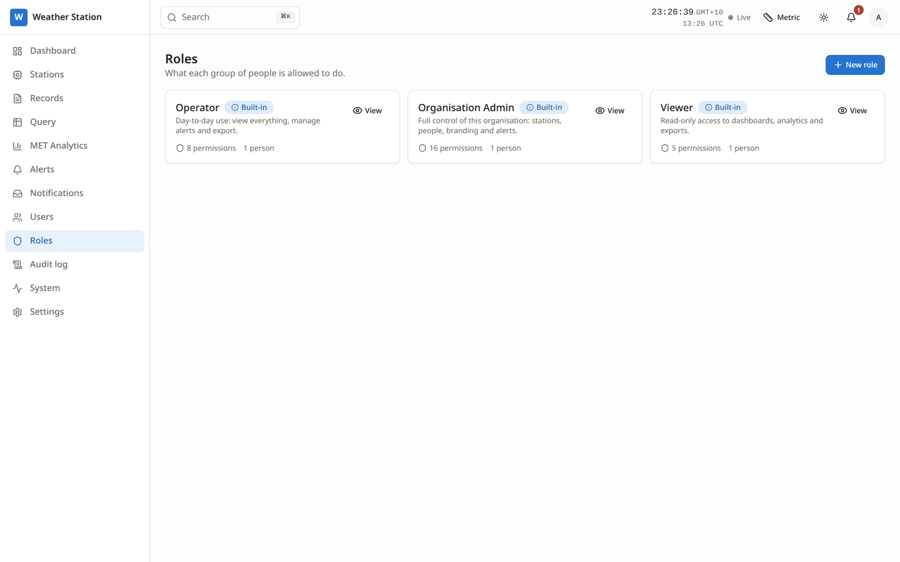

**Audit log** records every change — who did it, when, and from which PC — including
sign-ins, password resets and approvals.

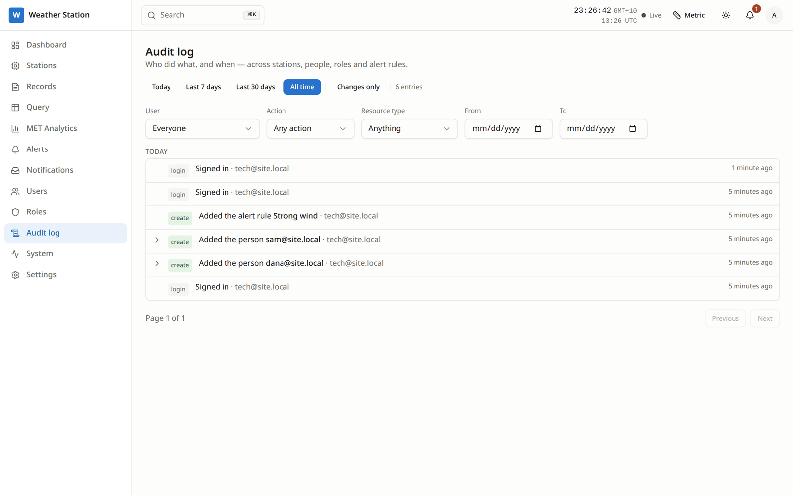

---

## 11. Settings

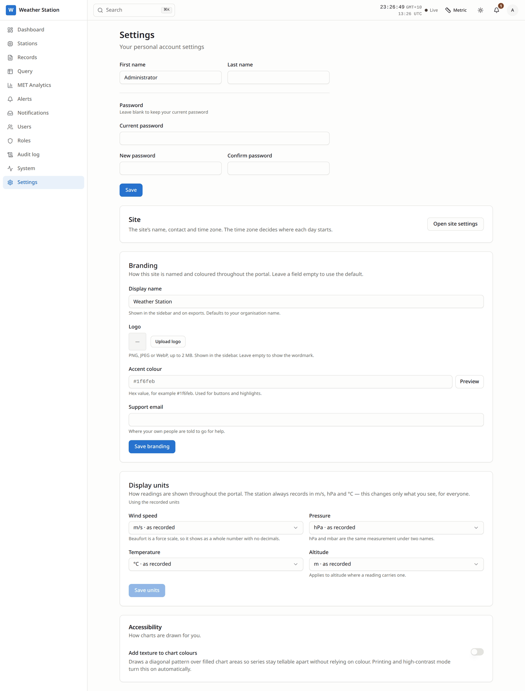

- **Profile** — your name and your password.
- **Display units** *(administrators)* — wind in m/s, km/h, knots, mph or Beaufort,
  and the pressure and temperature units. This changes only how readings are shown,
  for everyone; what is stored never changes.
- **Branding** *(administrators)* — the name, logo and accent colour of the portal.
- **Accessibility** — patterns on chart colours, for colour-blind readers and for
  printing in black and white.

**Site** *(administrators)* holds the site's name, contact and **time zone**.

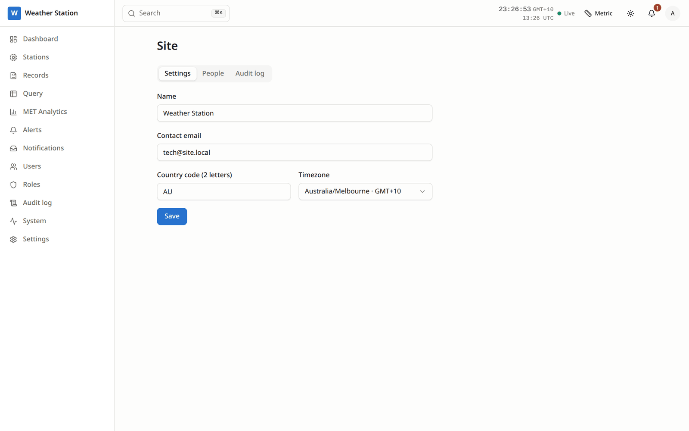

> The time zone decides where each day starts, so it decides every daily total. Set it
> once, correctly, when the PC is installed.

---

## 12. Who can do what

| | Viewer | Operator | Admin |
|---|:---:|:---:|:---:|
| Dashboard, Query, Records, Analytics | ✓ | ✓ | ✓ |
| Download CSV and exports | ✓ | ✓ | ✓ |
| System (the PC's own health) | — | ✓ | ✓ |
| Create and edit alert rules | — | ✓ | ✓ |
| Edit the station | — | — | ✓ |
| Users, roles, audit log | — | — | ✓ |
| Site settings, branding, units | — | — | ✓ |

---

## 13. Common questions

**How far back does the data go?** To the day the station was installed. Readings are
never deleted.

**The wind dial says "1-minute average" instead of "Live".** No reading has arrived for
five seconds. Check **System**, or ask an administrator to.

**The alert says a higher figure than the dashboard did.** It is not a mistake: a rule
fires on the highest reading of the minute, the dashboard shows that minute's average.
The alert names which it is.

**Times look an hour out.** Times are the station's, not your PC's. If they are wrong,
either the site's time zone (Settings → Site) or the station PC's clock needs checking.

**Nothing is updating.** Look at **Live** in the top bar and then at **System**. If the
sensor stream is not connected, the converter or the network is the place to start.

---

*Observator Weather Station 1.0.0 — the install and day-to-day care of the PC itself
are covered in [INSTALL.md](INSTALL.md), [OPERATIONS.md](OPERATIONS.md) and
[TROUBLESHOOTING.md](TROUBLESHOOTING.md).*
